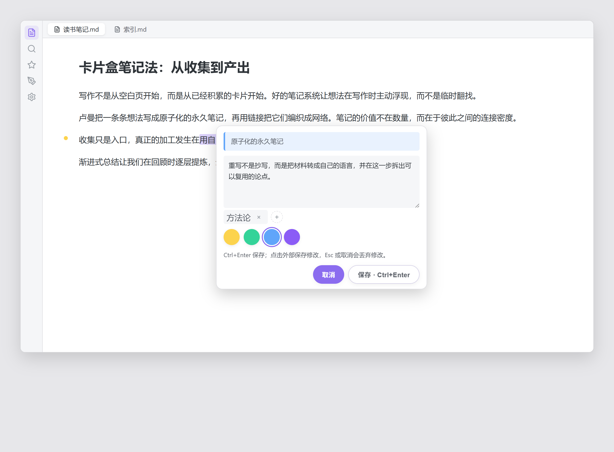
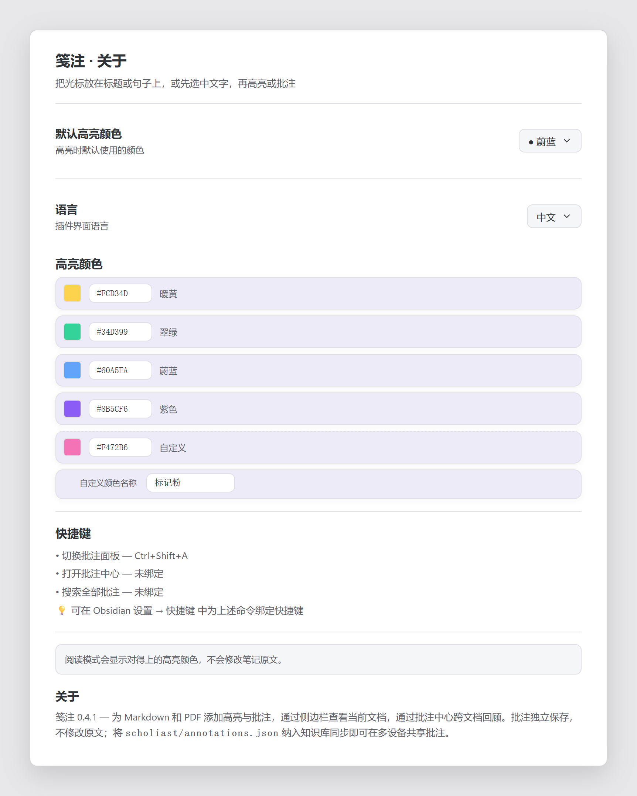

# Scholiast

**笺注** — 为 Obsidian 中的 Markdown 笔记和 PDF 添加高亮、想法和标签，再通过侧边栏或批注中心回顾。批注独立存储，不向原文插入标记，也不修改 PDF 文件。

插件名称：`Scholiast`；插件 ID：`scholiast`。界面支持中文和 English。

## 效果预览

> 以下截图取自插件默认的中文界面与浅色主题；插件跟随你的主题与语言设置。

**在 Markdown 中高亮与批注** —— 选中文字后出现浮动色板，点击颜色即时高亮。


**写批注面板** —— 引用原文、输入想法、添加标签并挑选颜色，`Ctrl+Enter` 保存。



**当前文档侧边栏** —— 搜索、按颜色和标签筛选、定位与编辑当前文档的批注。


**批注中心** —— 跨文档浏览、筛选，并在右侧查看批注详情与 Markdown 原文上下文。


**设置页** —— 修改默认颜色、添加自定义高亮色，并查看已绑定的快捷键。



## 仓库与分发

- **源码仓库（本仓库）**：[obsidian-annotation-plugin-src](https://github.com/github-oysl/obsidian-annotation-plugin-src)。包含 TypeScript 源码、样式、构建脚本和发布工作流。
- **插件分发仓库**：[obsidian-annotation-plugin](https://github.com/github-oysl/obsidian-annotation-plugin)。发布工作流将 `main.js`、`manifest.json` 和 `styles.css` 同步到该仓库并创建 Release。

主分支中的改动不一定已经发布。安装插件时使用分发仓库的 [Releases](https://github.com/github-oysl/obsidian-annotation-plugin/releases)；参与开发时使用本仓库。

## 当前能力

| 场景 | 支持内容 |
| --- | --- |
| Markdown 编辑 | 选中文字后通过浮动色板、右键菜单或命令创建高亮、批注；也可对光标所在正文或标题操作 |
| Markdown 阅读 | 对能够匹配原文的批注显示高亮；点击高亮打开编辑面板 |
| PDF | 在同一页内选中文字并创建高亮、批注；按页码定位 |
| 当前文档侧边栏 | 搜索、按颜色和标签筛选、排序、定位、编辑、导出及清除当前文档批注 |
| 批注中心 | 跨文档搜索；按文件、文件夹、颜色、标签和时间筛选；列表或网格浏览；查看批注详情和 Markdown 原文上下文 |
| 批注整理 | 标签、修改颜色、复制原文或批注、复制 Obsidian 链接、转成独立 Markdown 笔记 |
| 批量整理 | 在侧边栏多选模式中创建分组、归入分组及拖拽整理 |
| 导出 | 导出当前文件或整个知识库的批注为 Markdown |
| 撤销 | Markdown 编辑器内的批注新增、删除、修改接入编辑器撤销栈 |

默认色板为黄、绿、蓝、紫。颜色可以在设置中修改，也可以添加一个有名称的自定义色。浮动工具栏、编辑面板和卡片颜色菜单使用同一套设置。

## 安装

1. 从 [分发仓库的 Release](https://github.com/github-oysl/obsidian-annotation-plugin/releases) 下载 `main.js`、`manifest.json`、`styles.css`。
2. 在知识库配置目录下创建 `plugins/scholiast/`。默认路径为 `.obsidian/plugins/scholiast/`；使用自定义配置目录时，以实际配置目录为准。
3. 将三个文件放入该目录。
4. 在 Obsidian 的社区插件设置中启用 **Scholiast**；必要时重新加载 Obsidian。

插件声明的最低 Obsidian 版本见 [manifest.json](manifest.json)，支持桌面和移动端。PDF 定位及浮动界面的实际表现也受宿主版本影响。

## 使用

### 添加高亮或批注

在 Markdown 编辑器中选中一段文字：

- 点击浮动工具栏的颜色按钮添加高亮（见上方“在 Markdown 中高亮与批注”截图）。
- 点击“批注”打开编辑面板。
- 也可通过右键菜单或 Obsidian 命令面板执行对应操作。

PDF 请在**同一页**的文本层内选中文字，再使用右键菜单或对应命令。扫描图片式 PDF 没有可选文本时，不能直接创建文字批注。

### 编辑与保存

在卡片上点击铅笔图标，或在“更多”菜单中选择编辑。编辑面板的结构见上方“写批注面板”截图。

- **保存按钮 / Ctrl+Enter / Cmd+Enter**：保存并关闭。
- **点击面板外部 / 关闭按钮**：草稿发生变化时保存，包括清空批注文字、只修改颜色或标签。
- **取消 / Esc**：丢弃本次修改。
- **保存失败**：面板保留草稿并显示错误，可以重试。
- **Tab / Shift+Tab**：在输入框、标签、色板和按钮之间移动焦点。
- **色板内方向键**：切换选中颜色。

清空已有批注文字并保存，会保留原文高亮。打开新建面板后直接关闭、且没有修改草稿，不会创建空记录。

### 侧边栏与批注中心

通过命令“切换批注面板”打开当前文档侧边栏，通过“打开批注中心”查看跨文档列表。

- 侧边栏点击卡片定位到原文；批注中心点击卡片查看详情。
- 卡片上的定位按钮跳转到原文，铅笔按钮编辑批注。
- 较长的原文默认折叠，可点击“展开原文”阅读全文。批注正文保留换行。
- 筛选条件显示为可移除的标签；“清除筛选”恢复完整列表。
- 批注中心的排序使用独立入口，支持文档位置、创建时间和修改时间（见“批注中心”截图中的“排序: 文档位置”）。
- 宽面板中可拖动详情分隔线调整宽度；也可聚焦分隔线后按左右方向键。
- 窄面板中详情占据列表区域，点击“返回批注列表”返回并保留浏览位置。
- 批注中心“更多”菜单可切换紧凑或舒适间距。

### 分组与导出

在侧边栏“更多”菜单中开启多选模式，选中批注后创建分组或归入已有分组。分组支持展开、折叠、重命名和取消分组，拖拽整理在多选管理模式中使用。

侧边栏提供当前文档导出；批注中心“更多”菜单提供全部批注导出。导出会在知识库中创建 Markdown 文件，并提示保存位置。

### 原文变化后

插件使用选中文字、相邻上下文和位置尝试重新匹配原文。无法匹配、存在多个候选或源文件已删除时，卡片显示对应状态，并保留批注内容。

需要重新指定时：先在 Markdown 原文中选中新句子，再在批注菜单中执行“重新指定”。无法匹配时不应把旧行号视为当前准确位置。

## 数据与多设备同步

批注和分组保存于知识库根目录：

```text
scholiast/annotations.json
```

- 安装后不会立即创建该文件；第一次保存批注或迁移已有数据时创建。
- 插件设置保存在 Obsidian 的插件配置数据中，批注数据与设置分开。
- 旧版插件目录中的批注数据以及旧存储路径会尝试迁移到当前路径。
- 多设备共享批注依赖你的知识库同步工具，需将上述 JSON 文件纳入同步。
- 插件本身不提供云账户、云存储或多设备同时编辑的冲突合并服务。备份知识库时请同时备份此文件。
- 禁用插件后原文保持不变；需要恢复高亮显示时重新启用插件并保留批注数据。

## 已知边界

- PDF 暂不支持跨页选区；PDF 操作不接入 Markdown 编辑器的撤销栈。
- 阅读模式只显示能在渲染文本中匹配的高亮，代码块、行内代码和数学区域不参与该渲染；Markdown 源文本与渲染文本差异可能影响匹配。
- 原文大幅修改或句子重复时，自动定位可能失效，需要手动重新指定。
- 列表当前完整渲染，大量批注时仍有性能优化空间。
- 视图、排序和间距选择目前属于当前面板会话状态。

## 开发

需要 Node.js 和 npm。安装依赖并启动监听构建：

```sh
npm ci
npm run dev
```

生产构建包含 TypeScript 检查并生成压缩后的 `main.js`：

```sh
npm run build
```

运行保存、重试、色板、筛选和详情选中行为的回归测试：

```sh
npm test
```

这些测试替代 Obsidian 宿主 API，覆盖插件逻辑；实际主题、移动端软键盘和 PDF 布局仍需在 Obsidian 中验证。

将构建后的 `main.js`、`manifest.json`、`styles.css` 复制到测试知识库的插件目录，重新加载插件进行宿主环境验证。不要将个人知识库或批注数据提交到源码仓库。

主要文件：

| 文件 | 职责 |
| --- | --- |
| `src/main.ts` | 插件生命周期、命令、编辑器和界面协调 |
| `src/annotation-model.ts` / `src/types.ts` | 数据结构、归一化和默认设置 |
| `src/store.ts` | 数据读写、迁移和批注更新 |
| `src/anchor.ts` / `src/annotation-range.ts` | 原文匹配与选区定位 |
| `src/editor-highlights.ts` / `src/reading-highlight.ts` / `src/pdf.ts` | 各文档模式的高亮与交互 |
| `src/sidebar.ts` / `src/library-view.ts` | 当前文档管理和跨文档批注中心 |
| `src/annotation-card.ts` / `src/note-modal.ts` | 共用卡片和草稿编辑面板 |
| `src/annotation-query.ts` / `src/filter-popover.ts` / `src/filter-chips.ts` | 搜索、排序、筛选与条件展示 |
| `src/highlight-colors.ts` / `src/note-draft.ts` | 共用色板和草稿变化判断 |
| `src/i18n.ts` / `src/settings.ts` / `styles.css` | 中英文案、设置和主题样式 |

README 中的界面截图保存在 `docs/screenshots/`，由 [`docs/render-screenshots.mjs`](docs/render-screenshots.mjs) 基于插件真实的 `styles.css` 与界面结构渲染。重新生成前需先安装 `puppeteer`（建议作为开发依赖）：

```sh
npm i -D puppeteer
node docs/render-screenshots.mjs
```

本地安装的 agent 技能可以通过 `.git/info/exclude` 忽略，不需要随插件发布。

## 发布

发布流程定义于 [.github/workflows/release.yml](.github/workflows/release.yml)：

1. 更新 `manifest.json` 与 `package.json` 的版本号并完成验证。
2. 创建与 `manifest.json` 版本一致的纯版本号 Git tag，例如 `0.3.5`，不带 `v` 前缀。
3. 推送 tag 后，GitHub Actions 安装依赖并构建。
4. 工作流将构建产物同步到分发仓库的主分支，并创建或更新对应 Release 附件。

维护者需配置具有分发仓库写权限的 `RELEASE_TOKEN`。普通主分支推送不会触发正式发布。

## English overview

Scholiast adds highlights, notes and tags to Markdown and PDF files in Obsidian without modifying the source documents. Use the sidebar for the current file and the annotation library to search and review annotations across your vault.

The screenshots above show the default light theme in Chinese: the floating color palette in the editor, the note composer, the current-file sidebar, the cross-vault annotation library, and the settings page. The plugin follows your Obsidian theme and language.

Install `main.js`, `manifest.json` and `styles.css` from the [distribution releases](https://github.com/github-oysl/obsidian-annotation-plugin/releases) into your vault's `plugins/scholiast/` configuration directory. This repository contains the source code; the distribution repository contains release artifacts.

Save with the button or Ctrl/Cmd+Enter. Clicking outside saves changed drafts, including color-only edits and cleared notes. Cancel or Esc discards changes. Failed saves keep the draft open. Tab moves focus normally; arrow keys select colors within the palette.

Annotations and groups live in `scholiast/annotations.json` at the vault root. Include this file in your vault synchronization and backups. The plugin does not provide its own cloud sync or concurrent-edit conflict resolution. PDF selections must remain within a single page; reading-mode highlights depend on matching rendered text.

For development, run `npm ci`, then `npm run dev` or `npm run build`. Version tags matching the manifest trigger the distribution workflow; pushing the main branch alone does not create a release.

## License

[MIT](LICENSE)
