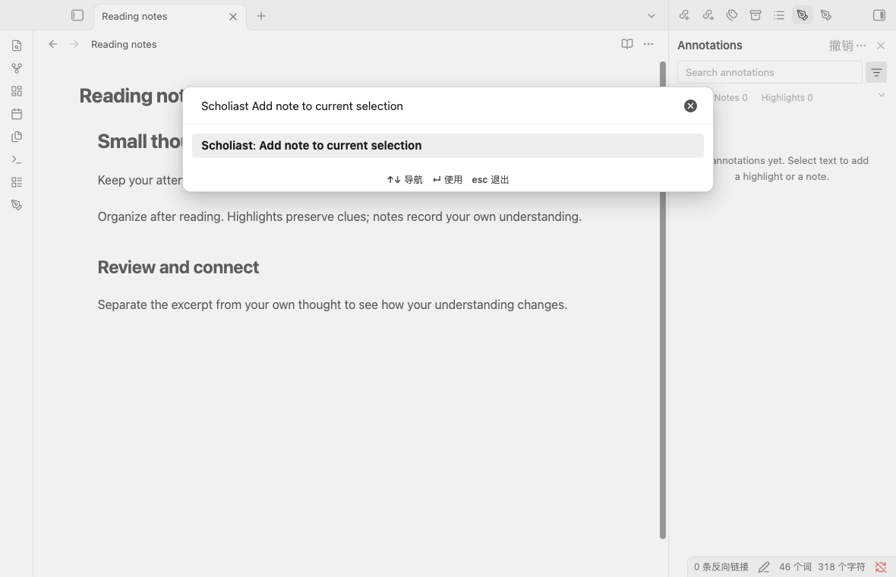
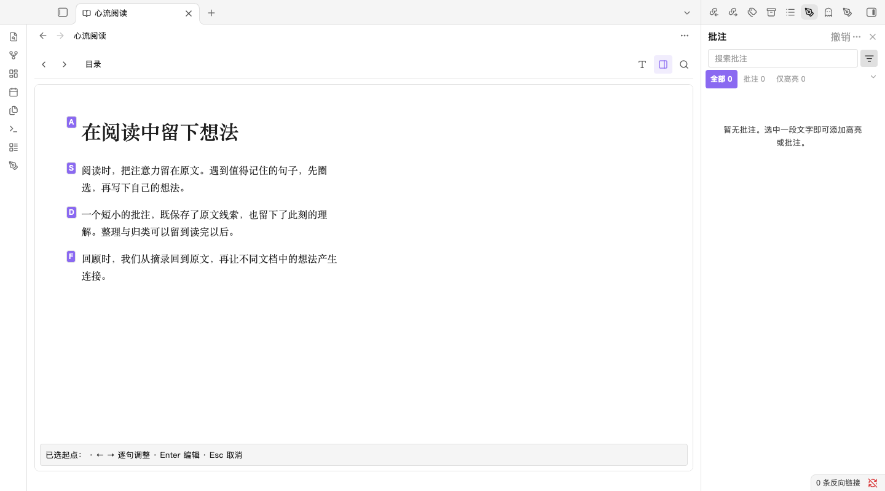
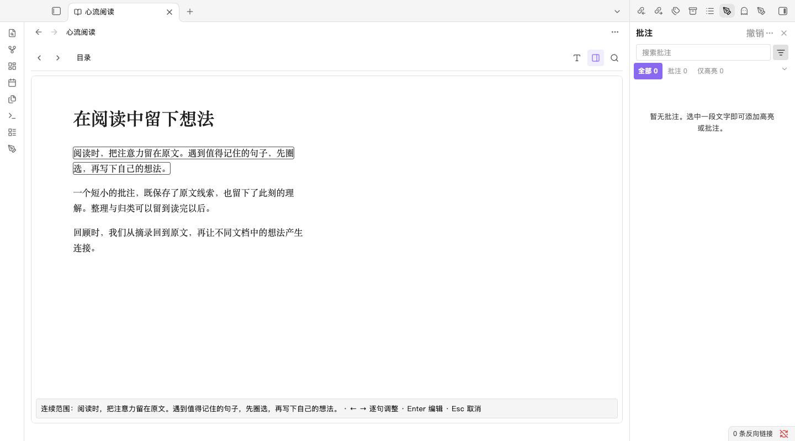
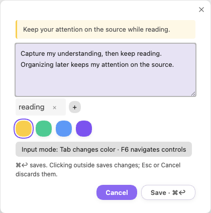
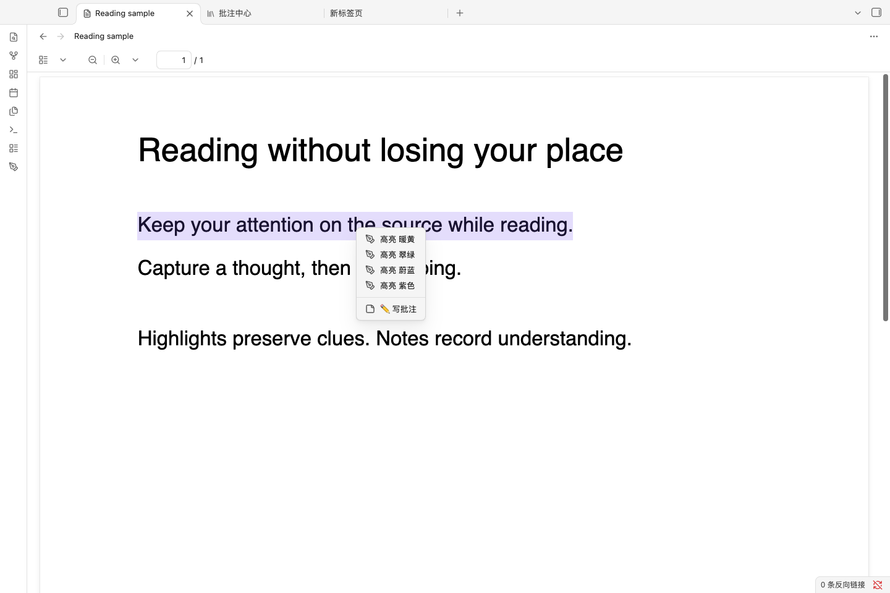
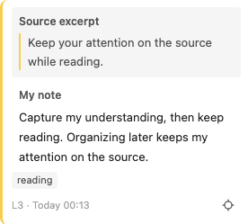
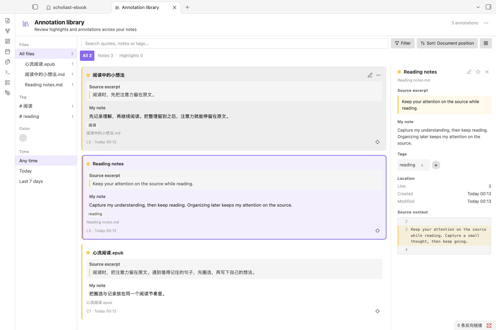
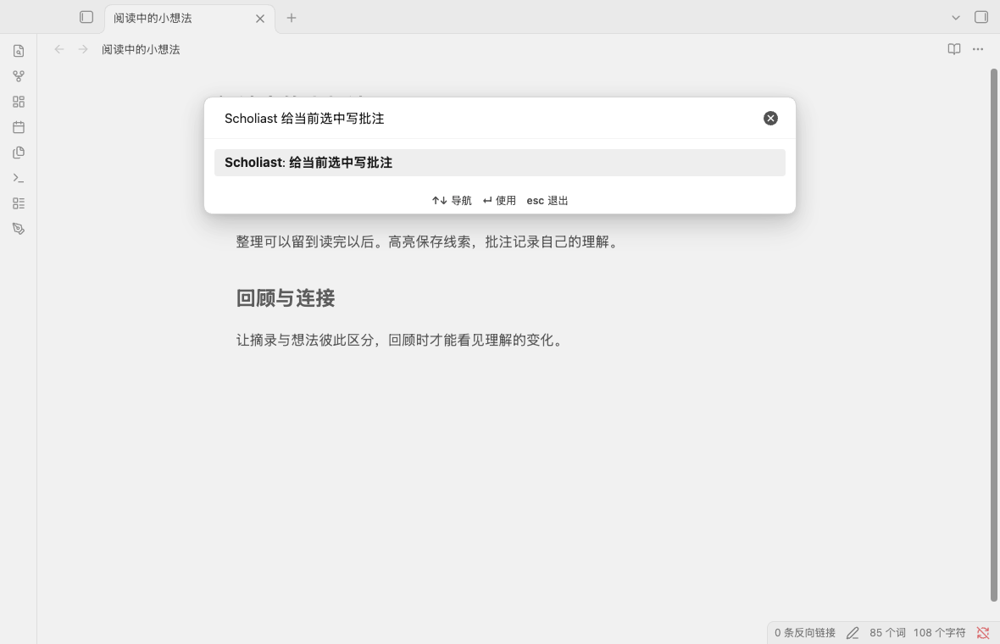
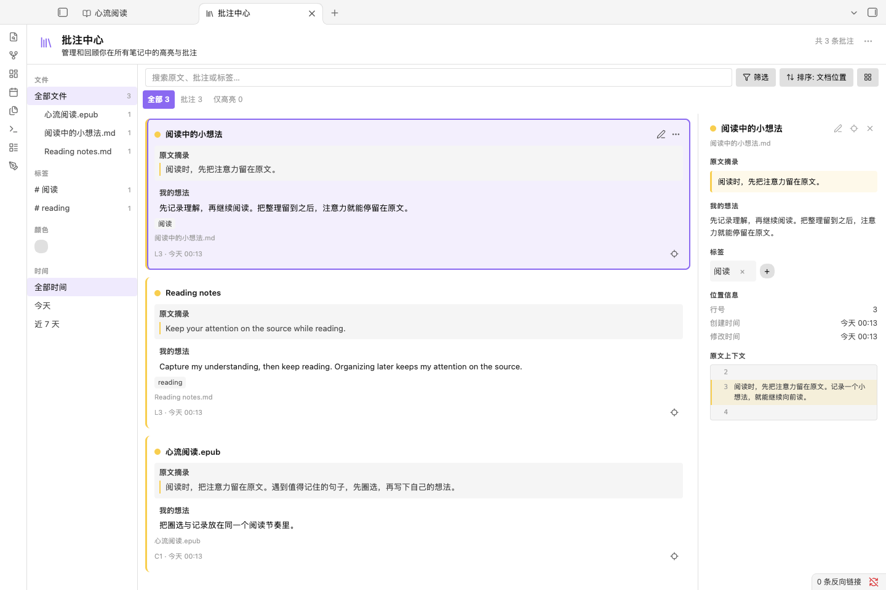

# Scholiast · 笺注

Read Markdown, PDF and ebooks in Obsidian — **select and capture without the mouse in Markdown and ebooks**, keeping your flow and leaving the original file untouched.

在 Obsidian 里读 Markdown、PDF 和电子书——**在 Markdown 与电子书里不动鼠标圈选、随手记下想法**，阅读不中断，原文不被改动。

[English guide](#english-guide) · [中文使用指南](#中文使用指南) · [源码与开发说明](docs/README.md)

> User manual for **0.7.0** (flow notes) / **0.7.0 使用手册（心流笔记）**. Minimum Obsidian version: **1.13.0**。

All screenshots below were captured in **Obsidian for macOS (desktop), Scholiast 0.7.0**, using original demo documents. English examples use English plugin text; the host UI follows its own language setting.

以下截图均来自 **macOS 桌面版 Obsidian 中实际运行的 Scholiast 0.7.0**，使用原创演示文档；英文示例切换插件语言，宿主界面语言独立设置。

## English guide

Scholiast exists to keep you reading: highlight and note in place, without switching windows or reaching for the mouse. We call it **flow notes**.

Search **Scholiast** in the command palette for all commands; settings live in **Settings → Scholiast**, key bindings in **Settings → Hotkeys**. This page covers only the common paths.

### Flow notes in 30 seconds

- **Capture in place:** highlight, write a note and add tags right on the source; the original file is never modified and no markers are inserted.
- **Keyboard first:** in Markdown, place the cursor and record; in ebooks, hold the activation key, type a label to select, and use Left/Right to extend.
- **Capture now, organize later:** grouping, review and export wait until after reading.

Annotations are stored separately under the vault's `scholiast/` folder and can sync with the vault; reading and annotation need no network.

> **PDF does not support flow notes yet.** Selecting text and annotating in PDF still depends on the context menu and cannot be done by keyboard without interrupting reading. Better PDF keyboard support is on the roadmap; the flow experience today centers on Markdown and ebooks.

### Install and update

1. Download `main.js`, `manifest.json` and `styles.css` from the [distribution releases](https://github.com/github-oysl/obsidian-annotation-plugin/releases), or from the same tested build.
2. Create `plugins/scholiast/` in your vault configuration directory (usually `.obsidian/plugins/scholiast/`) and place the three files there.
3. Enable **Scholiast** in **Settings → Community plugins**. To update, replace the three files and reload; keep your existing `data.json` and the vault's `scholiast/` folder.

Plugin ID: `scholiast`. The reader engine is bundled offline; no calibre, account or conversion service is required. For a development build, see the [source documentation](docs/README.md).

### Quick start (keyboard first)

**Markdown**

1. Place the cursor on a sentence, heading or code line (or select text first).
2. Run **Add note to current selection**, or **Highlight current selection (default color)**, from the command palette.
3. Press `Enter` / `Ctrl+Enter` to save; `Tab` / `Shift+Tab` cycles colors without touching the mouse.

**Ebooks**

1. In **Settings → Scholiast**, enable **keyboard selection** (once); `Space` is the default activation key.
2. Click into the text and hold `Space` until paragraph labels appear, then type a label to choose a start.
3. Use Left/Right to extend by sentence; press `Enter` to open the note editor and save.

Mouse works too: select text and use the floating toolbar's color or pencil. **PDF is currently context-menu only** (keyboard flow support is planned).

### Recommended shortcuts

Bind these four commands in **Settings → Hotkeys** so you rarely leave the keyboard. No command has a default shortcut; avoid assigning the ebook activation key to another action.

| Command | Use |
| --- | --- |
| Add note to current selection | Write a thought |
| Highlight current selection (default color) | Quick highlight |
| Toggle annotation panel | Review the current document |
| Undo last annotation operation | Take back a mistake |

### Annotate the three formats

| Format | How |
| --- | --- |
| Markdown | Select text, or just place the cursor to infer a range; the toolbar and command palette both highlight and add notes |
| PDF | Select text within one page and use the context menu to pick a color or **Write note**; scanned pages support page or region notes. **Keyboard flow is not supported yet** |
| EPUB, MOBI, AZW3, FB2 | Built-in reader for unencrypted files; annotate with the palette or pencil, and optionally enable keyboard selection |

**Honest limits:** ebook keyboard selection is **off by default** but becomes fully keyboard once enabled; **PDF cannot do flow notes yet** (see above) — selection and region notes still need the context menu, and only note editing, recoloring and undo work from the keyboard. Code or math ranges that exist only in the source cannot be shown fully in reading mode.

### The full-keyboard workflow

**Markdown: the cursor is the range.** You do not have to select first — **Highlight current selection** / **Add note to current selection** infers the range: an ATX heading uses its heading text, prose uses the current sentence (falling back to the paragraph), and fenced code uses the current nonempty code line. Empty lines and fence markers create nothing.

**Ebooks: label selection.** Hold the activation key → type a paragraph/sentence label to pick the start → use Left/Right to extend by sentence (the reader follows the endpoint across pages in the same chapter) → press `Enter` to write a note. Releasing the key alone never saves; `Esc` cancels, and `Backspace` steps back one level while choosing labels. Cross-chapter ranges are not supported yet.

**Delete and undo stay on the keyboard too.** Bind **Delete annotation (cursor / selected / visible page)**: it prefers the selected annotation or an exact range, and shows letter labels when several are visible — type a label to delete. Bind **Undo last annotation operation** to restore deletions, notes, colors, tags and groups; `Ctrl/Cmd+Z` still performs the editor's normal text undo.

### Review and organize

The pen ribbon icon or **Toggle annotation panel** reviews the current document; **Open annotation library** reviews across documents. Cards separate the **source excerpt** from **my note**, with search, color/tag/file filters and sorting. Click a card to return to the source, use the pencil to edit, and the more-actions menu to copy the excerpt, copy an exact link, recolor, reassign the position or turn it into a separate Markdown note. Multi-select can group cards and batch recolor or add tags.

Exports and separate notes are **one-way snapshots**; editing them never writes back to the stored annotations. For native tag workflows, add normal Markdown tags in the exported file.

### Data and privacy essentials

- Annotations, document identities and groups live in the vault's `scholiast/annotations.json`; reading position, recent reading and panel visibility in `scholiast/reading-state.json`; settings in the plugin's `data.json`.
- Back up the original files and both vault JSON files, and include them in vault sync across devices — but **avoid editing the same store on two devices at once**.
- Reading and annotation need no network; book scripts and external resources are blocked. There is no cloud account and no automatic conflict merging.
- Renaming or moving a source **inside Obsidian** preserves identity and annotations; deleting keeps records marked as missing. A new edition can break positions — the excerpt and note remain readable: use **Reassign** on a card, or **重新关联缺失文档** for a missing document.

### Troubleshooting

- **No ebook in the file list:** enable the host's “show all file types”, or use the read/import commands.
- **Highlight or position no longer matches:** the source may have changed; the excerpt and note remain — select the correct text and use **Reassign**.
- **No text in a scanned PDF:** use page or region notes; PDF selection cannot span pages.
- **Book does not open:** only unencrypted files up to 100 MiB are supported; DRM and conversion are not.
- **Can PDF be fully keyboard-driven like Markdown and ebooks?** Not yet — PDF remains context-menu first, and keyboard flow support is on the roadmap.
- **Mobile:** the quick-actions button offers Markdown highlight/note/panel entry points; mobile ebook flows still need acceptance testing.

For the complete command and settings reference, use the command palette, **Settings → Scholiast** and **Settings → Hotkeys**. Report issues with the plugin/Obsidian version, OS and steps in the [source issue tracker](https://github.com/github-oysl/obsidian-annotation-plugin-src/issues).

## 中文使用指南

Scholiast 想做的是让阅读不被打断：读到哪里、想到什么，就在原地高亮、记想法，不用切窗口，也不用找鼠标。我们把它叫作**心流笔记**。

命令面板搜索 **Scholiast** 可找到全部命令；详细设置见 **设置 → Scholiast**，键盘绑定见 **设置 → 快捷键**。本页只讲最常用的路径。

### 30 秒了解心流笔记

- **就地记录**：直接在原文上高亮、写想法、加标签，原文保持不动，不会插入任何符号。
- **键盘优先**：Markdown 把光标停在句子就能记；电子书按住激活键、输入标签即可圈选，左右键逐句增减。
- **先记后理**：分组、回顾、导出都留到之后，不打断当下阅读。

批注独立保存在知识库的 `scholiast/` 目录，可随知识库同步；阅读与批注不依赖网络服务。

> **PDF 暂不支持心流笔记。** 目前 PDF 的选文与批注只能通过右键菜单完成，无法在不中断阅读的情况下用键盘操作。改善 PDF 键盘体验已列入后续开发计划；现阶段的心流体验以 Markdown 和电子书为主。

### 安装与更新

1. 从[分发仓库 Releases](https://github.com/github-oysl/obsidian-annotation-plugin/releases) 下载 `main.js`、`manifest.json`、`styles.css`，或取自同一次已验证构建。
2. 在知识库配置目录下创建 `plugins/scholiast/`（常见为 `.obsidian/plugins/scholiast/`），放入这三个文件。
3. 在 **设置 → 社区插件** 启用 **Scholiast**。更新时替换这三个文件并重新加载即可，请保留已有的 `data.json` 与 `scholiast/` 数据目录。

插件 ID 为 `scholiast`；阅读引擎离线内嵌，不需要 calibre、账户或格式转换服务。源码构建见[开发说明](docs/README.md)。

### 快速上手（键盘优先）

**Markdown**

1. 光标停在想记的句子、标题或代码行上（也可以先选中一段文字）。
2. 命令面板运行 **给当前选中写批注**，或 **高亮当前选中（默认颜色）**。
3. `Enter` / `Ctrl+Enter` 保存；输入时 `Tab` / `Shift+Tab` 换色，全程不碰鼠标。

**电子书**

1. 在 **设置 → Scholiast** 打开 **启用键盘圈选**（只需一次），激活键默认 `Space`。
2. 点进正文，按住 `Space` 直到出现段落标签，输入标签选择起点。
3. 按左右键逐句增减范围，`Enter` 打开想法编辑器，保存后即成批注。

习惯鼠标也可以：选中文字后，用浮动工具栏选颜色或点铅笔写想法；**PDF 目前只能用右键菜单操作**（键盘心流支持在开发计划中）。

### 推荐快捷键

为下面四个命令在 **设置 → 快捷键** 绑定顺手的组合键，就能尽量不离开键盘。命令默认都没有快捷键，注意别把电子书的激活键再分给其他动作。

| 命令 | 用途 |
| --- | --- |
| 给当前选中写批注 | 记下想法 |
| 高亮当前选中（默认颜色） | 快速高亮 |
| 切换批注面板 | 回看当前文档 |
| 撤销上次批注操作 | 记错可撤 |

### 三种文档怎么批注

| 格式 | 怎么做 |
| --- | --- |
| Markdown | 选中文字，或只放光标让命令推断范围；浮动工具栏与命令面板都能高亮、写想法 |
| PDF | 在同一页内选中文字，右键选颜色或 **写批注**；扫描页可用页面批注或框选区域批注。**暂不支持键盘心流操作** |
| EPUB / MOBI / AZW3 / FB2 | 内置阅读器打开未加密文件，用色板或铅笔批注，可开启全键盘圈选 |

**如实说明边界**：电子书全键盘圈选**默认关闭**，开启一次后即可全程键盘；**PDF 目前无法支持心流笔记**（见上文说明），选文与区域批注仍依赖右键菜单，仅想法编辑、改色与撤销可用键盘。此外，仅在源码中存在的代码、公式范围无法在阅读模式完整显示。

### 全键盘工作流

**Markdown：光标即范围。** 不必先选文——`高亮当前选中` / `给当前选中写批注` 就近推断：标题取标题正文，正文取当前句子（无句界时取段落），围栏代码取当前非空代码行；空行与围栏标记不创建批注。

**电子书：标签圈选。** 按住激活键 → 输入段落/句子标签选起点 → 左右键逐句增减（同章节跨页会跟随终点）→ `Enter` 记想法。只松开激活键不会保存；`Esc` 取消，选择标签时 `Backspace` 回上一级。跨章节范围暂不支持。

**删除与撤销也不离键盘。** 绑定 **删除批注（光标 / 选择 / 可见页）**：优先删除已选批注或精确匹配的原文范围，可见页多条时显示字母标签，输入标签即可删除。绑定 **撤销上次批注操作** 可恢复删除、想法、颜色、标签与分组；正文的 `Ctrl/Cmd+Z` 仍是编辑器原本的文字撤销。

### 回顾与整理

侧栏笔形图标或 **切换批注面板** 查看当前文档，**打开批注中心** 跨文档回顾。卡片明确区分**原文摘录**与**我的想法**，支持搜索、颜色/标签/文件筛选与排序；点击卡片回原文，铅笔编辑，更多菜单可复制原文、复制精确链接、改色、重新指定位置或转为独立 Markdown 笔记。多选模式还能分组、批量改色或加标签。

导出与独立笔记都是**单向快照**，修改它们不会改回原批注；需要原生标签时，请在导出的 Markdown 中自行添加。

### 数据与隐私要点

- 批注、文档身份与分组存于知识库内 `scholiast/annotations.json`；阅读位置、最近阅读与面板开关存于 `scholiast/reading-state.json`；设置存于插件目录 `data.json`。
- 备份请包含原文件与上述两个知识库 JSON。多设备使用时纳入同步，并**避免两台设备同时编辑同一存储**。
- 阅读与批注不依赖网络，书内脚本与外部资源会被阻止；插件不提供云账户，也不自动合并多设备冲突。
- 在 Obsidian 内改名/移动原文件会保留身份与批注；删除仅保留记录并标记缺失。换版后原句可能失联，摘录与想法仍可读，可在卡片菜单 **重新指定**，或对缺失文件执行 **重新关联缺失文档**。

### 常见问题

- **文件列表找不到电子书**：启用宿主“显示所有类型文件”，或使用阅读 / 导入命令。
- **高亮或位置失联**：原文件可能已变化；摘录与想法仍在，选中正确原文后用 **重新指定**。
- **扫描 PDF 不能选文**：改用页面批注或区域批注；PDF 不支持跨页选区。
- **PDF 能否像 Markdown、电子书一样全键盘？**：目前不能——PDF 以右键菜单为主，键盘心流支持已列入后续开发计划。
- **电子书打不开**：仅支持未加密、不超过 100 MiB 的文件，不支持 DRM 与格式转换。
- **移动端**：快捷操作按钮提供 Markdown 高亮 / 写想法 / 侧栏入口；移动端电子书仍待验收。

更多命令、设置项与排查细节，以插件内命令面板、**设置 → Scholiast** 与 **设置 → 快捷键** 为准；如遇问题，可在[源码问题区](https://github.com/github-oysl/obsidian-annotation-plugin-src/issues)附上插件 / Obsidian 版本、系统与复现步骤。

## License / 许可

[MIT](LICENSE) · [Source / 源码](https://github.com/github-oysl/obsidian-annotation-plugin-src) · [Developer documentation / 开发文档](docs/README.md)
