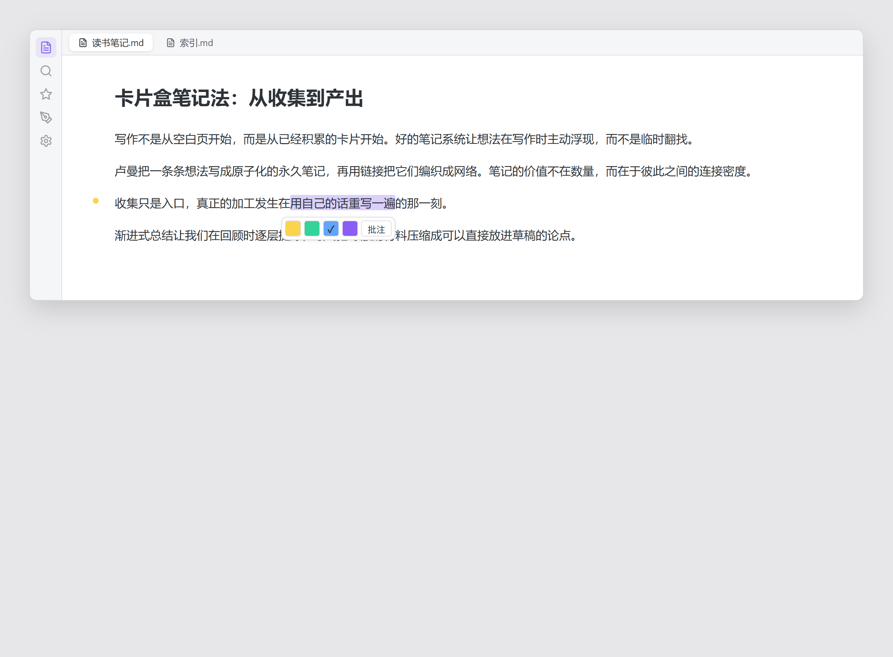
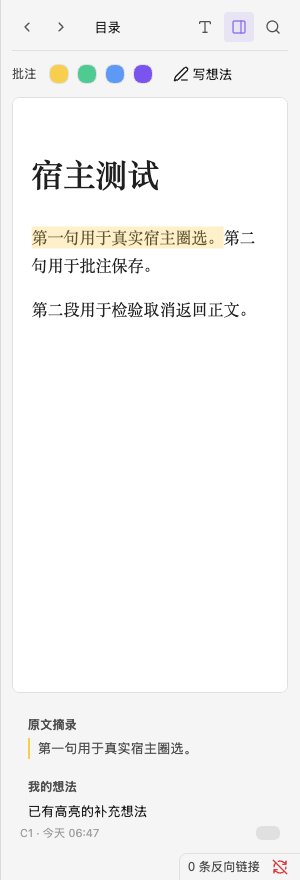
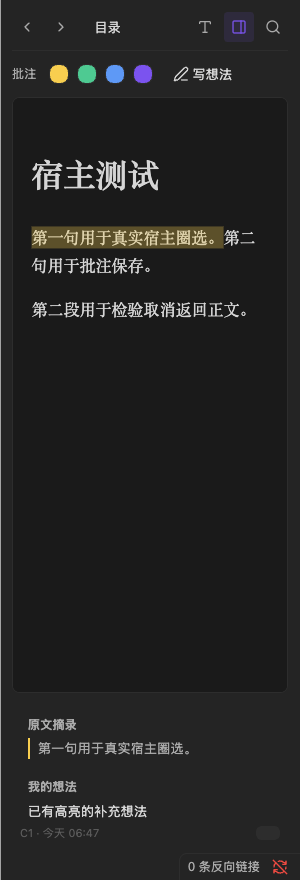
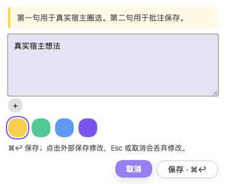
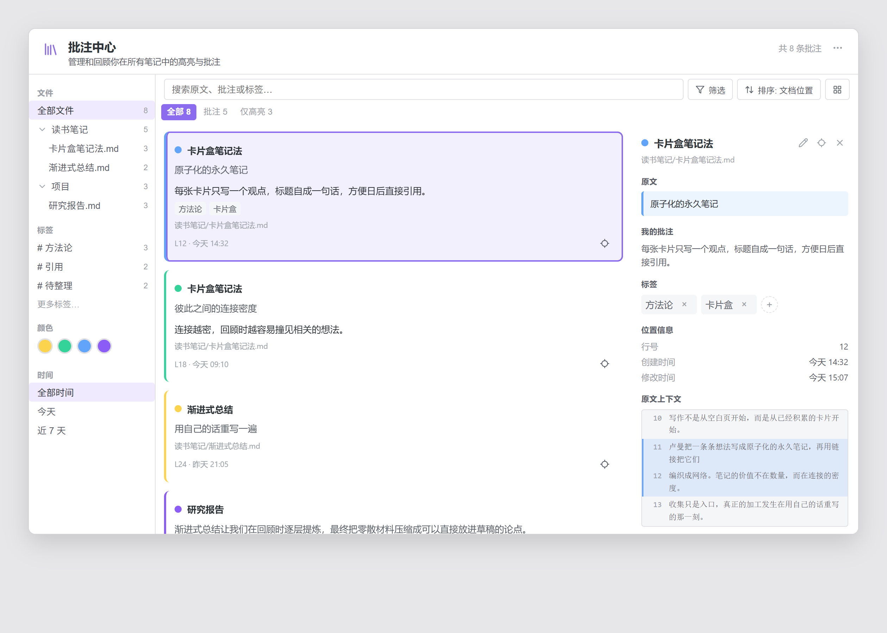

# Scholiast · 笺注

Read, highlight and write notes on Markdown, PDF and ebooks in Obsidian. Annotations stay separate from the original document.

在 Obsidian 内阅读 Markdown、PDF 和电子书，记录高亮、想法与标签。批注独立保存，不修改原始文档。

[English guide](#english-guide) · [中文使用指南](#中文使用指南) · [源码与开发说明](docs/README.md)

> Complete user manual for **0.6.0**. Minimum Obsidian version: **1.13.0**. / **0.6.0 完整使用手册**，最低 Obsidian 版本：**1.13.0**。

## English guide

Start with [installation](#install-and-update) and the [quick start](#quick-start), then choose [Markdown](#annotate-markdown), [PDF](#annotate-pdf) or [ebooks](#read-a-document). For daily review, see [groups](#organize-with-groups), [the library](#use-the-annotation-library), [exports](#export-and-create-notes), [commands](#command-reference), [settings](#settings-reference) and [data recovery](#data-privacy-and-troubleshooting).

### What Scholiast stores

A **highlight** keeps the excerpt, source location and color. A **note** adds your thoughts to that highlight. Both can have tags. Groups arrange annotations within a document; the annotation library brings all supported documents together.

The source stays unchanged. Highlights display while Scholiast is enabled; annotations live separately in your vault. They are not embedded in a PDF or ebook and will not automatically appear in external readers. Markdown exports and separate notes make material available to normal Obsidian links and workflows.

### Install and update

1. Download `main.js`, `manifest.json` and `styles.css` from the [distribution releases](https://github.com/github-oysl/obsidian-annotation-plugin/releases), or obtain all three from the same tested source build.
2. Create `plugins/scholiast/` inside your vault configuration directory. The usual path is `.obsidian/plugins/scholiast/`; use your actual directory if you changed it.
3. Place the three files there. In **Settings → Community plugins**, enable **Scholiast**. Reload Obsidian if necessary.
4. To update, replace those three files and reload the plugin. Keep your existing `data.json` and the vault's `scholiast/` data folder.

If Scholiast appears in the community plugin directory, install/update through **Settings → Community plugins → Browse**. Otherwise use the release files above. Disable the plugin before replacing files, then re-enable it.

Plugin ID: `scholiast`. The reader is bundled locally; no calibre, account or conversion service is needed. For a development build, see the [source documentation](docs/README.md).

### Quick start

1. Open a Markdown note in editing mode and select a sentence.
2. Choose a color in the selection toolbar for a highlight, or click the note/pencil action to write thoughts.
3. Click **Save**, then open the panel using the pen ribbon icon or **Toggle annotation panel**.
4. Click a panel card to return to the source. Its pencil edits; its more-actions menu copies, recolors or deletes.
5. Open **Annotation library** from the panel menu to review across files. Export when you want a Markdown snapshot.

For PDFs, use the text selection's right-click menu. For ebooks, open the file in Scholiast and use its reader color/note controls. Keyboard selection is optional and initially disabled.

### Annotate Markdown

**With a selection:** drag across text in the native editor. The floating toolbar offers colors and a note action; the right-click menu offers the same actions. A color saves a highlight immediately, while the note action opens a draft. You can also run **Highlight current selection (default color)** or **Add note to current selection** from the command palette.

**Without a selection:** those two commands infer a range at the cursor. An ATX heading targets its heading text; prose targets the current sentence, falling back to the paragraph if there is no sentence boundary; fenced code targets the current nonempty code line. Empty lines and fence markers create nothing. Select text explicitly for an exact range.

*Layout illustration of the selection workflow. Current host screenshots show the reader and editor below; theme, language and window size affect appearance.*

Highlights appear in editing and reading modes when the source still matches. Clicking a highlighted area in the editor brings its panel card into view; clicking an annotation in reading mode opens its editor. Place the editor cursor inside an annotation and use **Locate / Edit / Delete annotation at cursor**, or the corresponding editor-menu actions.

No Markdown highlight markers or comments are inserted into the note. Reading mode cannot show every source-only range, such as some code/math content. After source edits, check unmatched/ambiguous cards rather than trusting an old line number. Markdown annotation changes participate in the editor undo history alongside text edits.

### Annotate PDF

1. Open the PDF in Obsidian's native viewer.
2. Select text **within one page**, right-click, and choose a highlight color or **Write note**.
3. Save thoughts, color and tags in the shared editor. Use the panel to review and return to the page.

For scanned pages without selectable text, right-click the page and choose **添加页面批注** (“Add page note”) for the whole page, or **框选区域并批注** (“Select region and annotate”). In region mode, drag a rectangle on that page; **Esc** cancels. OCR is not required.

PDF cards show the page location. Locating a card opens its page and draws its saved highlight when the source and rotation still match. Cross-page text selection is unsupported: create one annotation per page. Region alignment uses the rendered page; source replacement or rotation changes may stop an old region drawing while retaining the note. Unified undo does not cover PDFs; delete a record through its card menu.

### Read a document

Keep the original file inside the vault. Open it in the file explorer, or use **Scholiast: 阅读当前学习文档** (“Read current learning document”). The file menu also offers **阅读学习文档** (“Read learning document”). If another plugin owns an ebook extension, use this command or menu entry.

To bring in files from outside the vault, use **导入学习文档** (“Import learning documents”). Import copies the originals; it does not convert formats or overwrite a different file with the same name. Use **最近阅读** (“Recent reading”) to continue later. In the import dialog choose a vault-relative destination (initially **Learning/Sources**), select one or more files, check the preview and click **复制并导入**. Same-name different files receive numbered names; identical ones are reused. Results appear per file, so one failure does not discard other imports.

| Format | Reading and annotation |
| --- | --- |
| Markdown | Native editor/reading view; text highlights, notes and tags |
| PDF | Native PDF view; text selection within one page, page notes and region notes |
| EPUB, MOBI, AZW3, FB2 | Built-in reader for unencrypted files; text highlights, notes and tags |

The ebook toolbar provides previous/next page, table of contents, search, annotation panel and display options. Open the **T** button for font size and paginated/continuous reading. The reader follows your light or dark theme. Reading position and panel visibility are saved per document; reopening resumes the saved location. Page boundaries may change with font size or window width.

*Screenshots use original sample text in an isolated test vault. The reader controls shown are currently labeled in Chinese.*

### Create and edit an annotation

Select text in Markdown or the ebook reader. Choose a color in the floating palette or reader toolbar to save a highlight, or choose the pencil action to write a note. For PDF, select text within one page and use the context menu. The PDF page menu also offers page/region annotation; region mode lets you drag a rectangle over a scanned page.

The editor keeps the source excerpt above your own note. Add tags and choose a color before saving.

| Action | Result |
| --- | --- |
| Save, `Ctrl+Enter` / `Cmd+Enter` | Save and close; an empty note can still create a highlight |
| Click outside or use the close button | Save a changed draft; an unchanged new draft creates nothing |
| Cancel or `Esc` | Discard the draft; keyboard selection returns to the reader |
| Save fails | Keep the draft open and retry |

Clearing an existing note keeps its highlight. Selecting an already annotated ebook range and pressing Enter edits the existing record rather than creating a duplicate.

### Select ebook text with the keyboard

This feature is **off by default**. Enable it in **Settings → Scholiast**, then choose the activation key (`Space`, backquote or `F8`) and hold duration. The initial configuration is **Space / 180 ms**.

1. Click inside the ebook text, then hold the activation key until paragraph labels appear.
2. Type the label beside a paragraph, then the label beside the starting sentence. Dense paragraphs first show sentence groups.
3. Release the activation key. Press **Left/Right** to shrink or extend the range one sentence at a time; the reader follows the endpoint across pages in the same chapter. You can also hold the activation key again and choose an endpoint label.
4. Press **Enter** to open the note editor. Save to create the annotation. Releasing Space alone never saves.
5. Use **Esc** to cancel a selection; **Backspace** goes back through label levels while choosing. Cross-chapter range operations pause; return to the starting chapter to continue, or press Esc to cancel.

Without a selected start, Left/Right turns pages. Short presses on an enabled activation key suppress its normal reading action. Cross-chapter selection is not supported.

### Review, organize and return to the source

The document panel and annotation library distinguish **Source excerpt** from **My note**: excerpts use a shaded block and colored border; your note appears below with its own label.

Use **Toggle annotation panel** for the current document, and **Open annotation library** to review across documents. Search, filter by colors/tags/files and sort the results. Click a panel card to return to the source; a library card opens details, and its locate icon returns to the source. The pencil edits a note. Long excerpts can be expanded.

The card menu can copy source text, copy a precise Obsidian link, change color, reassign a lost position or create a Markdown note. The panel/library can export annotations as Markdown. Exported files are editable snapshots; editing them does not update the stored annotations. The panel's multi-select mode also supports groups.

### Use the current-document panel

The pen ribbon icon opens the panel; **Toggle annotation panel** shows/hides it. It follows the active supported document. The ebook reader also has an internal panel toggle; on narrow windows that panel appears below the book.

- **All / Notes / Highlights:** Notes have nonempty thought text; a highlight has none, even if it has tags.
- **Search:** matches excerpts, thoughts and tags, ignoring case.
- **Filter:** choose colors/tags, optionally require thoughts or tags, then click **Apply**. **Reset** clears the filter. Any selected tag can match; different filter types combine.
- **Sort:** document position, created time or modified time. Time sorts show newest first.
- **Cards:** click to locate, use the pencil to edit, expand long excerpts, or open more actions. Add tags there or in the editor; remove them with tag remove controls.
- **Panel menu:** open the library, enter multi-select, export the document or clear its annotations. Clearing requires confirmation and preserves the source.

If the panel is empty, check the active document and clear search/filter conditions. Deleted files' annotations remain marked separately.

### Organize with groups

1. In the document panel menu choose **Multi-select**.
2. Check cards, choose **Group selected**, enter a name and confirm.
3. Click a group heading to expand/collapse it; its pencil renames it.
4. To move a card to an existing group, enter multi-select and drag that card onto the group.
5. Use **Ungroup** on the group heading to dissolve it after confirmation. Its records remain ungrouped.

Cancel selection exits without deleting anything. Groups belong to one document; tags/colors are independent and work across documents. Filters can hide a group if none of its records match.

### Use the annotation library

Run **Open annotation library** or choose it in the panel menu to open the full-page review workspace.

*Layout illustration; current cards use the “Source excerpt” / “My note” separation shown above.*

Use left navigation to choose a file/folder, tag, color or time range (**Any time**, **Today**, **Last 7 days**). Search also matches file paths. Combine these with **All / Notes / Highlights** and filters; reset conditions to restore the full collection. Time ranges use creation time.

The toolbar switches list/grid presentation and sorting; the header menu switches compact/comfortable spacing. Select a card for its excerpt, thoughts, tags, location, timestamps and available source context. Locate returns to the document; the pencil edits. Resize details by dragging the divider, or focus it and use arrow keys. Narrow screens show details in place of the list; **Back to annotations** restores the list.

The header menu also exports everything and opens the current panel, settings or help. **Batch manage** opens the current-document panel; choose **Multi-select** in that panel's menu next. It does not bulk-delete across the vault. **Search all annotations** opens quick search: type a query, select with Up/Down and press Enter to locate.

### Export and create notes

| Action | Entry | Result |
| --- | --- | --- |
| Export current document | Panel menu / **Export current file annotations** | Beside the source: **Book-annotations-export.md** in English, **Book-批注导出.md** in Chinese |
| Export all annotations | Library header menu | **scholiast-export.md** in the vault root, grouped by source |
| Turn one record into a note | Card menu → **Turn into note** | Separate Markdown note beside the source, named from the excerpt; numbered suffix for an existing name |
| Copy exact link | Card menu → **Copy Obsidian link** | An **obsidian://scholiast** link to the document and annotation |
| Copy text | Card menu → **Copy quote / Copy note** | Excerpt or thoughts on your clipboard |

Exports contain excerpts, thoughts, source links and locations. They include the current document/full collection, **not only visible filtered cards**. Exporting again replaces the same export file: rename/move edited exports first. Separate notes contain excerpt, thoughts and a source wikilink; creating one retains the annotation.

Exports and separate notes are snapshots. Editing them does not change the annotation; later annotation edits do not update old snapshots. Annotation tags are plugin metadata; use Markdown tags in a separate note for native tag workflows.

Exact links require the correct vault, existing source and enabled plugin. They locate the annotation when its position verifies. Copy/link/export actions do not upload a shared web copy.

### Configure undo and language

No command has a default hotkey. In **Settings → Hotkeys**, search for **Scholiast: 撤销（Markdown / 电子书）** and bind it to your preferred shortcut. You can use a consistent prefix for related reading actions.

- In Markdown, the unified undo uses the editor's undo history, including text edits.
- In an ebook, it removes the current document's latest annotation created during this plugin session. Editing an older note is not a new creation; the creation history resets when the plugin restarts.
- The plugin does not intercept `Ctrl/Cmd+Z` to implement ebook undo. PDF annotation undo is not included in this command.

Choose 中文 or English in plugin settings. Annotation cards, editors and the existing Markdown management interface follow that choice; some reading commands and reader controls currently retain Chinese labels.

### Command reference

Search **Scholiast** in the command palette. Editor/cursor commands require that context. Reader commands currently show Chinese labels in both languages.

| Command | Use |
| --- | --- |
| Toggle annotation panel | Show/hide the current-document panel |
| Open annotation library | Review across the vault |
| Highlight current selection (default color) | Markdown selection or inferred cursor range |
| Add note to current selection | Open a Markdown draft |
| Locate / Edit / Delete annotation at cursor | Work on the Markdown annotation containing the cursor |
| Search all annotations | Search excerpts, thoughts and tags; locate a result |
| Export current file annotations | Write a Markdown snapshot |
| Clear current file annotations | Delete that document's records after confirmation |
| 撤销（Markdown / 电子书） | Unified undo, with the limits above |
| 阅读当前学习文档 | Open the active supported document |
| 导入学习文档 | Copy external files into the vault |
| 最近阅读 | Choose a previously opened source and resume |
| 重新关联缺失文档 | Associate a missing document with a same-format vault file |
| 查看未识别批注 | Inspect preserved unsupported records, read-only |

No command has a default shortcut. In **Settings → Hotkeys**, choose consistent modifiers for highlight, note, panel, search and undo. Avoid assigning the ebook activation key to a competing action.

### Settings reference

| Setting | Use |
| --- | --- |
| Default highlight color | Color for the default-color Markdown command |
| Language | 中文 / English; some reading controls remain Chinese |
| Enable keyboard selection | Off initially; enables ebook labels/sentence selection |
| Activation key | Space / backquote / F8; initially Space |
| Hold duration | 120–800 ms, 20 ms steps; initially 180 ms |
| Highlight colors | Edit palette entries with six-digit hex values, e.g. **#FCD34D** |
| Custom color | Extra six-digit hex color; clear the field to remove it from the palette |
| Custom color name | Name for the extra color, up to 12 characters |
| Shortcuts | Shows bindings; change them in Obsidian Hotkeys |

Palette changes do not recolor existing records automatically. Edit an individual card for that. Font size and paginated/continuous layout belong to the reader's display controls. Reading position and the reader's panel visibility are remembered per document.

### Missing sources and unmatched annotations

Renaming/moving a source **inside Obsidian** preserves identity and annotations. Deleting one retains records marked as missing. Replacing a PDF/ebook edition can invalidate positions; excerpts and thoughts remain readable.

Restore the source or run **重新关联缺失文档**, choose the missing document and a same-format vault file. Check positions afterward, especially for another edition; reassociation neither converts the file nor guarantees matching excerpts.

For an unmatched/ambiguous card, open the intended source, select the correct text and choose **Reassign** in that card's menu. Markdown also allows the inferred cursor range. It keeps the record identity, thoughts and tags while changing the range. Repeated sentences are not resolved by guessing. Unrecognized records remain available through **查看未识别批注**; preserve them during troubleshooting.

### Data, privacy and troubleshooting

| Location | Contents |
| --- | --- |
| `scholiast/annotations.json` | Document identities, annotations and groups |
| `scholiast/reading-state.json` | Reading positions, recent-reading timestamps and panel visibility |
| Plugin `data.json` | Settings |

Back up the original files and both vault JSON files. Include them in your vault sync if you use multiple devices. Reading and annotation require no network service; book scripts and external book resources are blocked. Scholiast provides no cloud account or automatic conflict merging for simultaneous edits on different devices.

Version 0.6.0 migrates older annotation storage to schema v2 on saving and preserves a migration backup at `scholiast/annotations.json.v1-backup.json`. Before returning to an older plugin build, back up current data and use a compatible pre-migration backup.

- **No ebook in the file list:** enable the host's option to show all file types, or use the read/import commands.
- **Position or highlight no longer matches:** the source may have changed. Your excerpt and note remain available; select the correct text and use **Reassign**. Use **重新关联缺失文档** (“Rebind missing document”) if a source was moved outside Obsidian or is missing.
- **No text in a scanned PDF:** use page or region notes. PDF selection cannot span pages; region alignment degrades safely when rotation changes.
- **Book does not open:** unencrypted files up to 100 MiB are accepted. DRM files and format conversion are not supported; unusual publisher layouts may need another edition.
- **Reading resumes at the start:** reload the updated build. If it persists, report the book format, read layout, exit steps and whether `reading-state.json` exists, without sharing private book contents.

On mobile, the quick-actions button provides Markdown highlight/note/panel actions; you can also run commands after selecting text. Desktop right-click/hover steps do not apply to touch screens. Mobile ebook workflows still need acceptance testing.

Disabling/uninstalling removes the plugin interface; original documents remain intact. Keep annotation JSON if you may reinstall. Restore backups with the plugin disabled, keep a copy of current data, then reload and check the library. Sync JSON and original sources together, and avoid editing the same store on two devices at once.

macOS Obsidian EPUB workflows are covered by automated host tests, including creating a note and reopening/restarting. Windows, native IME, mobile and popout-window behavior still need further acceptance testing. Report issues in the [source issue tracker](https://github.com/github-oysl/obsidian-annotation-plugin-src/issues), including plugin/Obsidian version, OS and reproducible steps.

## 中文使用指南

首次使用从[安装](#安装与更新)和[快速上手](#快速上手)开始，再阅读 [Markdown](#markdown-批注)、[PDF](#pdf-批注)或[电子书](#打开文档继续阅读)部分。整理与回顾见[分组](#分组整理)、[批注中心](#批注中心完整用法)、[导出](#导出链接与独立笔记)、[命令](#完整命令表)、[设置](#设置项目说明)和[备份恢复](#数据隐私与常见问题)。

### 高亮、想法、标签和分组

**高亮**保存原文摘录、位置与颜色；**批注**在高亮上增加自己的想法，两者都可以有标签。**分组**用于整理同一文档的记录，**批注中心**汇总知识库里所有支持格式的批注。

原文保持不变，高亮由启用中的插件显示，数据另存于知识库。批注不会嵌入 PDF 或电子书，也不会自动出现在其他阅读软件里。需要接入普通 Obsidian 链接、写作与笔记工作流时，可以导出 Markdown 或转成独立笔记。

### 安装与更新

1. 从[分发仓库 Releases](https://github.com/github-oysl/obsidian-annotation-plugin/releases) 下载 `main.js`、`manifest.json`、`styles.css`，或获取同一次已验证源码构建的这三个文件。
2. 在知识库配置目录下创建 `plugins/scholiast/`。常见路径为 `.obsidian/plugins/scholiast/`；使用自定义配置目录时，以实际目录为准。
3. 放入三个文件，在 **设置 → 社区插件** 中启用 **Scholiast**；必要时重新加载 Obsidian。
4. 更新时替换这三个文件并重新加载插件，保留已有 `data.json` 和知识库内的 `scholiast/` 数据目录。

若社区插件目录已可搜索到 Scholiast，可从 **设置 → 社区插件 → 浏览** 安装与更新，否则使用以上 Release 文件。替换文件前先禁用插件，之后重新启用。

插件 ID 为 `scholiast`。阅读引擎随插件离线打包，不需要 calibre、账户或格式转换服务。源码构建见[开发说明](docs/README.md)。

### 快速上手

1. 在编辑模式打开 Markdown，选中一句话。
2. 浮动工具栏选颜色立即高亮；点击批注/铅笔按钮写想法。
3. 保存后，通过左侧笔形图标或 **切换批注面板** 查看卡片。
4. 点击侧栏卡片回原文；铅笔编辑，更多菜单复制、改色或删除。
5. 在侧栏菜单打开 **批注中心** 跨文件回顾，需要 Markdown 快照时再导出。

PDF 从选区右键菜单添加；电子书从内置阅读器色板/批注按钮添加。电子书全键盘圈选默认关闭，可按需启用。

### Markdown 批注

**选中文字：**在原生编辑器拖选，浮动工具栏提供颜色与写批注入口，右键菜单也提供相同操作。点击颜色立即保存高亮，写批注先打开草稿。命令面板的 **高亮当前选中（默认颜色）** 和 **给当前选中写批注** 也可使用。

**只放光标：**上述两个命令会自动取范围。ATX 标题取标题正文，普通正文取当前句子，缺少句界时取段落；围栏代码块取当前非空代码行。空行与围栏标记不创建批注。需要精确范围时请明确选文。

*这是选区操作布局示意。下面的阅读器与编辑器图片来自当前宿主实测，实际界面随主题、语言和窗口大小变化。*

原文仍匹配时，编辑模式与阅读模式都会显示高亮。编辑器中点击高亮会滚动到对应侧栏卡片，阅读模式中点击批注会打开编辑器。把光标放在已有批注范围内，使用 **定位 / 编辑 / 删除光标处的批注或高亮**；编辑器右键菜单也有对应操作。

插件不会往原文插入 Markdown 高亮符号或注释。部分仅在源码中存在的代码、公式范围不能在阅读模式完整显示。原文编辑后若位置失联或有歧义，请查看卡片状态并重新指定。Markdown 批注增删改进入编辑器撤销历史，与正文编辑共用历史。

### PDF 批注

1. 在 Obsidian 原生阅读器打开 PDF。
2. 在**同一页内**选中文字，右键选择高亮颜色或 **写批注**。
3. 在共用编辑器填写想法、标签、颜色并保存，侧栏可回顾并定位该页。

扫描件没有可选文字时，在页面上右键选择 **添加页面批注**，或 **框选区域并批注**。区域模式下在该页拖出矩形；按 **Esc** 取消。不需要先做 OCR。

卡片显示页位置，定位会打开对应页；源文件与旋转仍匹配时绘制保存的高亮。文本不支持跨页选区，请分成多条。区域基于渲染页面定位，更换文件版本或旋转后可能停止绘制旧区域，想法仍保留。统一撤销命令暂不覆盖 PDF，需要移除时用卡片删除操作。

### 打开文档，继续阅读

原始文件应位于知识库内。从文件列表打开，或执行 **Scholiast：阅读当前学习文档**；文件菜单也有 **阅读学习文档**。其他插件已关联电子书后缀时，可通过这些入口打开。

知识库外的文件使用 **导入学习文档**，导入只复制原文件，不转换格式，也不覆盖同名但内容不同的文件。导入对话框中填写知识库相对目录（初始 **Learning/Sources**），选择一个或多个文件、核对预览并点击 **复制并导入**。同名但不同内容自动加序号，相同内容复用；逐个显示结果，某个失败不影响其他文件。之后通过 **最近阅读** 继续。

| 格式 | 阅读与批注 |
| --- | --- |
| Markdown | 原生编辑器与阅读视图；文字高亮、想法和标签 |
| PDF | 原生 PDF 阅读器；同页文字批注、页面批注与区域批注 |
| EPUB、MOBI、AZW3、FB2 | 内置阅读器打开未加密文件；文字高亮、想法和标签 |

电子书工具栏提供翻页、目录、书内搜索、批注面板和显示选项。点击 **T** 调整字号或切换分页/连续滚动。正文跟随深浅主题；阅读位置和批注面板开关按文档保存，重新打开恢复到已保存的位置。字号和窗口宽度变化时，分页边界可能改变。

*截图使用独立测试知识库中的原创样本，没有个人知识库内容。*

### 添加高亮与想法

在 Markdown 或电子书正文中选中文字，通过浮动色板或阅读器色板保存高亮，点击铅笔写想法。PDF 请在同一页的文本层中选文并使用右键菜单；页面菜单也支持页面与区域批注。区域模式可在扫描页上拖出矩形。

编辑器上方保留原文摘录，下方填写想法，并可添加标签、选择颜色。

| 操作 | 结果 |
| --- | --- |
| 保存、`Ctrl+Enter` / `Cmd+Enter` | 保存并关闭；想法留空也可创建纯高亮 |
| 点击面板外部或关闭按钮 | 保存已改变的草稿；未修改的新草稿不创建记录 |
| 取消或 `Esc` | 丢弃草稿；键盘圈选返回正文继续操作 |
| 保存失败 | 保留草稿，可以重试 |

清空已有想法并保存，会保留高亮。电子书中对已有批注范围按 Enter，会进入原记录编辑，不重复创建。

### 全键盘电子书圈选

功能**默认关闭**。先在 **设置 → Scholiast** 中启用，并配置激活键（`Space`、反引号或 `F8`）与按住时长，初始值为 **Space / 180 毫秒**。

1. 点击电子书正文，按住激活键，直到出现段落标签。
2. 输入段落标签，再输入起点句子的标签；句子较多时先选择句组。
3. 松开激活键后，按**左/右方向键**逐句收缩或扩展范围；同章节跨页时阅读器会跟随终点。也可再次按住激活键，通过标签选择终点。
4. 按 **Enter** 打开想法编辑器，保存后才创建批注。仅松开 Space 不会保存。
5. **Esc** 取消圈选；选择标签时 **Backspace** 返回上一级。跨章节范围操作会暂停；返回起点章节继续，或按 Esc 取消。

未选起点时，左右键用于翻页。启用后短按激活键会抑制其原有阅读动作。当前不支持跨章节范围。

### 回顾、整理与返回原文

批注卡片明确分为**原文摘录**和**我的想法**：摘录使用底色与彩色边线，自己的想法在下方单独显示。

通过 **切换批注面板** 查看当前文档，通过 **打开批注中心** 跨文档回顾。支持搜索、颜色/标签/文件筛选和排序。侧栏点击卡片回原文；批注中心点击卡片查看详情，定位图标回原文，铅笔编辑想法。长摘录可展开。

卡片菜单支持复制原文、复制精确 Obsidian 链接、修改颜色、重新指定位置或转成独立 Markdown 笔记。侧栏和批注中心可导出 Markdown；导出是可编辑快照，修改导出文件不会改回原批注。侧栏的多选模式还支持分组整理。

### 当前文档侧栏完整用法

左侧笔形图标打开侧栏，**切换批注面板** 可以显示/隐藏；侧栏跟随当前活动的支持文档。电子书阅读器还有内部面板开关，窄窗口下置于正文下方。

- **全部 / 批注 / 仅高亮：**有非空想法才算批注，只有标签而没有想法仍算高亮。
- **搜索：**匹配原文摘录、想法和标签，英文不区分大小写。
- **筛选：**可多选颜色与标签，以及只看有想法/有标签的记录，点击 **应用** 生效，**重置** 清除。标签满足任意所选项即可，不同种类的条件一起限制结果。
- **排序：**文档位置、创建时间或修改时间；时间排序按最新在前。
- **卡片：**点击定位，铅笔编辑，长摘录展开，更多菜单操作。标签可从更多菜单/编辑器添加，使用标签删除控件移除。
- **侧栏菜单：**打开批注中心、多选、导出当前文件、清空当前文件。清空会要求确认，只移除批注，保留原始文档。

内容为空时，先确认活动文档，再清除搜索和筛选条件。已删除文件的批注会保留并单独标记。

### 分组整理

1. 侧栏更多菜单选择 **多选**，勾选需要整理的卡片。
2. 点击 **分组所选**，输入组名并确认，分组属于当前文档。
3. 点击组标题展开/折叠，组标题的铅笔用于重命名。
4. 移到已有组时，进入多选模式，把单张卡片拖到目标组上。
5. 组标题的 **取消分组** 经确认后解散分组，批注回到未分组，不会删除。

**取消选择**仅退出多选。标签和颜色独立于分组，适合跨文档主题。筛选隐藏组内全部记录时，该组也可能暂时不显示。

### 批注中心完整用法

通过 **打开批注中心** 命令或侧栏菜单进入整页回顾界面。

*布局示意；当前卡片已使用上图中的“原文摘录 / 我的想法”分区。*

左侧按文件/文件夹、标签、颜色或时间范围（**全部时间 / 今天 / 近 7 天**）缩小范围。搜索也匹配文件路径，可与 **全部 / 批注 / 仅高亮** 和筛选组合。时间范围依据创建时间；清除条件可恢复完整集合。

顶部切换列表/网格和排序，标题更多菜单可切换紧凑/舒适间距。选卡片后看原文、想法、标签、位置、时间及可获取的原文上下文，定位图标回原文，铅笔编辑。拖动分隔条调整详情宽度，也可聚焦分隔条后用方向键；窄屏详情替代列表，使用返回按钮回列表。

标题菜单还可以导出全部、打开当前文件侧栏、设置和帮助。**批量管理**先打开当前文件侧栏，再从侧栏菜单进入 **多选**，不是全库批量删除。**搜索全部批注**会打开独立快速搜索框：输入关键词，上下键选择，回车定位结果。

### 导出、链接与独立笔记

| 操作 | 入口 | 结果 |
| --- | --- | --- |
| 导出当前文档 | 侧栏菜单 / **导出当前文件批注** | 原文件旁边的 **书名-批注导出.md**，英文设置下为 **Book-annotations-export.md** |
| 导出全部 | 批注中心标题菜单 | 知识库根目录 **scholiast-export.md**，按源文件分节 |
| 单条转笔记 | 卡片菜单 → **转为笔记** | 原文件旁边独立 Markdown，摘录生成文件名，同名自动加序号 |
| 复制精确链接 | 卡片菜单 → **复制 Obsidian 链接** | 指向文档和该批注的 **obsidian://scholiast** 链接 |
| 复制文字 | 卡片菜单 → **复制原文 / 复制批注** | 摘录或想法写入剪贴板 |

导出包含摘录、想法、来源链接与位置，导出当前文档/全部集合，**不局限于筛选后可见卡片**。重复导出覆盖同名导出文件，已经编辑的导出请先改名或移动。转笔记包含摘录、想法、来源双链，不删除原批注。

导出和独立笔记都是快照，不双向同步：修改快照不会改原批注，之后修改批注也不会更新旧快照。批注标签是插件数据，需要原生标签工作流时，在独立 Markdown 中添加普通标签。

精确链接要求正确的知识库、存在的原文件和已启用的插件，位置可验证时返回对应批注。复制、链接和导出不会上传共享网页副本。

### 统一撤销与语言

插件不预设命令快捷键。在 **设置 → 快捷键** 中搜索 **Scholiast：撤销（Markdown / 电子书）**，按自己的习惯绑定，也可以为相关阅读动作统一前缀。

- Markdown 使用原编辑器撤销历史，其中也包含正文编辑。
- 电子书撤销当前文档在本次插件运行期间最近创建的批注。编辑已有批注不算新建；插件重启后，新建记录的撤销历史会重置。
- 插件不拦截 `Ctrl/Cmd+Z` 来实现电子书撤销，该命令暂不包括 PDF 批注撤销。

设置中可选择中文或 English。卡片、批注编辑器及既有 Markdown 管理界面跟随语言设置；部分阅读命令和阅读器控件当前仍使用中文。

### 完整命令表

命令面板搜索 **Scholiast**。编辑器/光标命令依赖相应上下文，阅读命令当前在中英文设置下均显示中文。

| 命令 | 用途 |
| --- | --- |
| 切换批注面板 | 显示/隐藏当前文档侧栏 |
| 打开批注中心 | 全知识库回顾 |
| 高亮当前选中（默认颜色） | Markdown 选区或光标自动范围 |
| 给当前选中写批注 | 打开 Markdown 草稿 |
| 定位 / 编辑 / 删除光标处的批注或高亮 | 操作光标所在的 Markdown 批注 |
| 搜索全部批注 | 搜索摘录、想法、标签并定位 |
| 导出当前文件批注 | 创建 Markdown 快照 |
| 清空当前文件批注 | 确认后删除该文档记录 |
| 撤销（Markdown / 电子书） | 按上述范围统一撤销 |
| 阅读当前学习文档 | 打开当前支持文档 |
| 导入学习文档 | 复制外部文件到知识库 |
| 最近阅读 | 选择此前打开的来源并继续 |
| 重新关联缺失文档 | 为缺失文档指定相同格式的知识库文件 |
| 查看未识别批注 | 只读查看保留的未识别记录 |

命令不预占默认快捷键。在 **设置 → 快捷键** 中可自行统一高亮、编辑、侧栏、搜索和撤销的修饰键组合，避免把电子书激活键再分给冲突动作。

### 设置项目说明

| 项目 | 用法 |
| --- | --- |
| 默认高亮颜色 | Markdown 默认颜色命令采用的颜色 |
| 语言 | 中文 / English，部分阅读控件仍为中文 |
| 启用键盘圈选 | 初始关闭，启用电子书标签与逐句圈选 |
| 激活键 | Space / 反引号 / F8，初始 Space |
| 按住时长 | 120–800 毫秒，步长 20 毫秒，初始 180 毫秒 |
| 高亮颜色 | 使用六位十六进制改色板，如 **#FCD34D** |
| 自定义颜色 | 额外六位颜色，清空输入即可从色板移除 |
| 自定义颜色名称 | 额外颜色的显示名称，最多 12 字符 |
| 快捷键 | 查看现有绑定，实际修改在 Obsidian 快捷键设置 |

修改色板不自动改掉已有批注颜色，单条改色请编辑卡片。字号和分页/连续滚动属于阅读器显示控件。阅读位置及阅读器批注面板开关按文档记住。

### 缺失文件与失联位置恢复

在 **Obsidian 内**改名/移动原文件，会保留文档身份与批注；删除后记录保留并标记缺失。替换 PDF/电子书版本可能使位置失效，原摘录和想法仍可阅读。

恢复原文件，或执行 **重新关联缺失文档**，选择缺失文档及知识库内相同格式的文件。尤其换版后应检查位置；关联不会转换格式，也不保证所有原句匹配。

失联/歧义卡片：打开正确来源并选中应有原文，再在该卡片菜单选 **重新指定**。Markdown 也允许自动光标范围。操作保留记录身份、想法和标签，只更新原文范围；重复原句不会被随意猜测匹配。无法识别的记录可由 **查看未识别批注** 查看，排查期间请保留。

### 数据、隐私与常见问题

| 位置 | 内容 |
| --- | --- |
| `scholiast/annotations.json` | 文档身份、批注和分组 |
| `scholiast/reading-state.json` | 阅读位置、最近阅读时间和面板开关 |
| 插件目录内 `data.json` | 设置 |

备份原文件和两个知识库 JSON 文件。多设备使用时，将它们纳入知识库同步。阅读与批注不依赖网络服务，书内脚本和外部资源会被阻止。插件不提供云账户，也不会自动合并不同设备同时修改产生的冲突。

0.6.0 在保存时将旧批注存储迁移至 schema v2，并保留 `scholiast/annotations.json.v1-backup.json`。回滚旧插件前，应先备份当前数据，并使用兼容的迁移前备份。

- **文件列表找不到电子书**：启用宿主显示所有类型文件的选项，或使用阅读/导入命令。
- **原文位置或高亮失联**：原文件可能已变化，摘录和想法仍保留。选择正确原文并执行**重新指定**；文件在 Obsidian 外移动或缺失时，使用**重新关联缺失文档**。
- **扫描 PDF 不能选文**：使用页面或区域批注。PDF 不支持跨页选区，旋转变化时区域绘制会安全降级。
- **电子书打不开**：仅接受未加密、大小不超过 100 MiB 的文件。不支持 DRM 与格式转换，特殊出版社排版可能需要换版。
- **恢复阅读仍跳到首页**：重新加载更新后的构建。若仍出现，反馈文件格式、阅读布局、退出操作及 `reading-state.json` 是否存在，无需提供私人正文。

移动端快捷操作按钮提供 Markdown 高亮、写批注与侧栏入口，也可选文后运行命令。桌面右键/悬停步骤不适用于触屏，移动端电子书仍待验收。

禁用/卸载后插件界面消失，原文保留；计划重装时请保留批注 JSON。恢复备份时先禁用插件、另存当前数据，再恢复文件并重载检查批注中心。同步原文与 JSON 时避免两台设备同时编辑同一存储。

自动宿主测试覆盖 macOS Obsidian 的 EPUB 流程，包括创建批注、关闭重开和进程重启。Windows、原生输入法、移动端和弹出窗口仍需进一步验收。请在[源码问题区](https://github.com/github-oysl/obsidian-annotation-plugin-src/issues)附上插件/Obsidian 版本、系统与复现步骤。

## License / 许可

[MIT](LICENSE) · [Source / 源码](https://github.com/github-oysl/obsidian-annotation-plugin-src) · [Developer documentation / 开发文档](docs/README.md)
