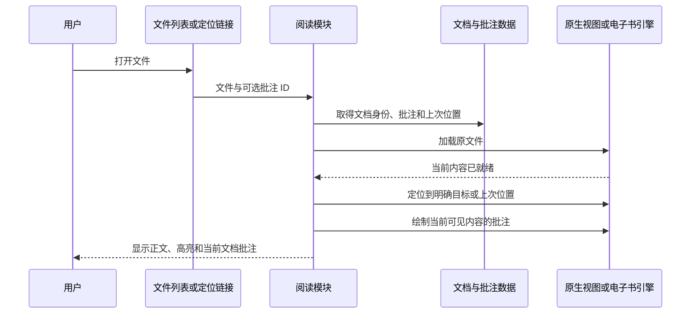
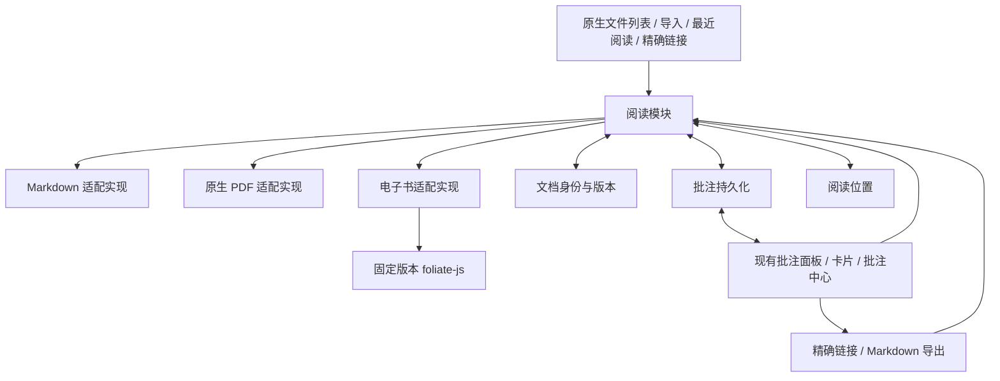

# Scholiast 多格式阅读与批注设计

版本：0.1，2026-10-09。状态：产品范围已逐项确认，设计文档待最终核对，技术方案待原型验证。本次交付为文档。

源码基线：HEAD `1064fcf`，插件 `0.5.0`，最低 Obsidian `1.13.0`。前置调研见 [格式支持调研](../research/document-format-support.md)，领域术语见 [CONTEXT](../../CONTEXT.md)。

## 1. 产品目标与已确认范围

用户可以在 Obsidian 原生文件列表中打开学习文档，选文高亮、写想法、添加标签；关闭或重启后再次打开同一个文件，仍能看到之前的高亮和批注，并继续阅读。点击任意批注或复制到 Markdown 笔记中的定位链接，能够打开原文件并到达对应内容。

| 决策 | 用户确认的结果 |
| --- | --- |
| 首期对象 | Markdown、PDF、电子书；图片、音频、视频后续考虑 |
| 电子书格式 | 无 DRM 的 EPUB、MOBI、AZW3、FB2 |
| 打开体验 | 原文件直接阅读；转换作为不兼容文件的备用路线 |
| 主入口 | 原生文件列表＋导入＋最近阅读；首期不做独立书架 |
| 原文件归属 | 外部导入复制进知识库；已在知识库内的文件直接打开 |
| 平台 | 桌面 Windows/macOS；当前仅 Windows 实测，编写时兼顾 macOS |
| 重新打开 | 恢复位置、高亮和批注面板；记住用户关闭面板的选择 |
| 互链边界 | 精确回原文＋复制链接＋导出 Markdown；不自动建立每书笔记 |
| 旧批注 | 必须保留并恢复本插件旧版 Markdown/PDF 数据 |
| 外部笔记 | 其他阅读器的批注导入后续处理 |

“可以阅读”必须同时包括文件打开、文字呈现、创建批注、保存、重开恢复和跳回原文。某格式在阅读引擎支持清单中，并不等于它已经达到插件的交付标准。

首期不提供书籍账户、云端书城、自动文献管理、DRM 处理、PDF 写回、全书转 Markdown、原始电子书内容的原生图谱索引或多设备同时编辑冲突合并。电子书正文只读；用户写下的批注可编辑。

## 2. 文件列表与阅读入口

### 2.1 原生文件列表优先

Obsidian 的 “Show all file types” 设置可以让任意后缀显示在文件列表和快速切换器，并允许链接。[官方设置](https://obsidian.md/help/settings)

插件通过 `registerView` 注册电子书阅读视图，通过 `registerExtensions` 将目标后缀关联到该视图。本地依赖声明具有这两个公开接口，也具有 `FileView`、`EditableFileView`、`readBinary/createBinary` 和文件加载生命周期。[官方类型声明](https://github.com/obsidianmd/obsidian-api/blob/master/obsidian.d.ts)

电子书视图使用文件视图体系；当前依赖提供 `EditableFileView`，可支持文件标题重命名，书籍正文保持只读。不使用 `TextFileView` 读取二进制电子书。MD 和 PDF 保留宿主原有打开方式，不重新注册或替换其扩展名。

注册电子书扩展名后，在关闭 “Show all file types” 时是否仍正常显示、另一阅读插件占用扩展名时如何处理、禁用后的路由恢复，公开接口没有完整保证。这些都是 P0 原型测试项，不能通过修改宿主私有注册表来绕过。

如果后缀被其他插件占用，保留“用 Scholiast 阅读”命令和文件右键菜单，在独立 leaf 中显式打开我们的阅读视图。逐个关联扩展名，某项失败不能影响 MD、PDF 或其他已支持格式。插件不自动修改用户的全局文件显示设置。

### 2.2 入口与最小管理能力

- **文件列表**：点击 MD/PDF 保持原生体验；点击已关联电子书进入阅读视图。
- **导入学习文档**：选择一个或多个文件及目标文件夹，复制并显示逐项结果。
- **用 Scholiast 阅读**：为扩展名冲突、没有默认关联的文件提供显式入口。
- **最近阅读**：按最后打开时间显示文件名、格式和上次位置，点击继续阅读；不维护另一套文件夹或藏书实体。
- **批注中心**：继续跨文档搜索、筛选、回顾与定位。

“最近阅读”和批注中心使用同一文档身份，不新增与真实文件脱节的书架目录。来源文件夹由用户指定，示例目录如下，插件不强制现有文件迁移：

```text
知识库/
  Learning/
    Sources/
      线性代数.pdf
      设计原理.epub
      计算机系统.azw3
    Notes/                       # 用户普通 MD 笔记，可选
  scholiast/
    annotations.json             # 旧路径保留，升级为 schema v2
    reading-state.json           # 可恢复的阅读位置和最近阅读
```

## 3. 用户流程

### 3.1 已有文档直接阅读

1. 用户打开知识库中的文件，无须再次“导入”。
2. 插件识别格式，找到或首次创建文档记录。
3. 正文就绪后恢复该文档的阅读位置和已有高亮，显示其批注。
4. 选中文字：点击色板创建高亮；点击“批注”填写想法、标签并保存。
5. 保存成功后卡片立即出现，当前及其他已打开的同文档视图同步刷新。

对扫描 PDF，没有文字层时提供页面/区域批注，用户仍可写想法；不模拟不存在的选文能力。区域批注没有摘录文字时显示“第 N 页区域”，不阻止保存。OCR 不纳入首期。

### 3.2 外部文件导入

1. 通过文件选择或拖入入口取得文件；首期全部复制到知识库内。
2. 检查目标格式、文件大小、内容签名与可读性。导入前界面给出文件名、目标目录和现有同名文件情况。
3. 同名文件不覆盖：建议保留独立文件名；内容完全相同的已导入文档可直接打开。不同内容不得因为文件名相同而继承批注。
4. 复制成功后注册文档身份；阅读引擎能完整打开后标记为就绪。
5. 批量导入逐文件提交，某个失败不撤销其他成功项。失败文件不进入最近阅读的成功列表，用户可重试或选择转换。

知识库内文件走“直接打开”路径，不再复制。导入过程中已有批注的数据文件不会被修改。解析失败时保留用户已经复制的原文件，并显示可理解的失败原因；不会删除来源文件或留下看似成功的批注关联。

### 3.3 关闭、重启与恢复

保存批注先完成持久化，再报告成功。用户关闭 leaf、切换文档或重启后，再次打开时使用以下顺序：



打开目标优先级：明确指定的批注位置 > 明确指定的章节/页码 > 上次阅读位置 > 文档开头。从批注跳转不能先恢复旧进度后又跳走；用户手动阅读后才更新上次位置。

电子书章节重建、翻页和重新排版时，根据引擎内容加载事件重新应用该章节批注，不能仅在第一次打开时绘制。PDF 页加载、缩放或布局变化同样重新应用对应页面批注。

恢复使用加载完成事件/Promise，并有超时提示，不靠一个固定延时假定 DOM 已存在。打开 A 后立即打开 B，A 的延迟回调必须取消或被会话标识忽略，不能把 A 的高亮画到 B。

### 3.4 精确回原文

所有入口复用同一个定位过程：批注卡片、批注中心、复制的链接以及导出 Markdown 中的“回到原文”。先解析文档身份，再打开正确文件/视图，再等待目标内容就绪，最后定位并短暂强调对应高亮。

定位结果分为：准确命中、只到达页/章、多个候选、原文已变、文件缺失、阅读器不可用。只有准确命中可以报告“已定位”。降级到页/章时保留批注卡片并提示范围；不得静默跳到第一页假装成功。

## 4. 阅读引擎与轮子选型

| 格式 | 首选 | 我们负责的内容 | 准入边界 |
| --- | --- | --- | --- |
| Markdown | Obsidian 编辑器、CodeMirror、已有阅读模式高亮 | 复用现有选区、定位、撤销和批注面板 | 修复不能误读其他格式的分发逻辑 |
| PDF | Obsidian 原生 PDF 阅读器 | 选区/区域与旁挂批注适配，准确跳页和高亮恢复 | 原生 PDF 内部集成不是完全公开接口；兼容差异留在适配实现内 |
| EPUB/MOBI/AZW3/FB2 | 固定提交的 foliate-js | 知识库文件加载、宿主视图、持久化、链接、统一批注交互 | 每种格式通过保存/重开/定位、安全与性能测试后开放 |
| EPUB 备用 | epub.js | 复用已有选区、高亮和 CFI 跳转 | 只能替代 EPUB 能力，不能满足其他格式 |
| 不兼容电子书 | 用户主动使用 calibre 转换后作为新文档导入 | 清晰提示、保留旧摘录 | 不透明转换、不自动继承原格式位置 |

目标包含多格式原文件阅读，因此 foliate-js 是首选原型。它具备相应格式解析、分页、覆盖层和导航能力，但 README 声明接口不稳定。[foliate-js README](https://github.com/johnfactotum/foliate-js)

复用引擎的 `addAnnotation/showAnnotation/getCFI/goTo` 等能力，不自行写 EPUB/MOBI 解码器、分页算法或高亮绘制引擎。非 EPUB 的位置可能是引擎模拟的 CFI，不能声称在不同引擎或转换后的文件之间通用。[官方 view.js](https://raw.githubusercontent.com/johnfactotum/foliate-js/main/view.js)

PDF++ 作为可选联动候选，不成为安装前提或批注数据来源。它有开发接口，但依赖宿主私有接口且正在重构，不能将其当成稳定通用 SDK。PDF 不走 foliate-js 的实验 PDF 适配器。[PDF++](https://github.com/RyotaUshio/obsidian-pdf-plus)、[开发接口](https://github.com/RyotaUshio/obsidian-pdf-plus/wiki/For-developers)

## 5. 模块设计



### 5.1 对外 Interface

以下为设计草案，不是声称第三方库具有同名接口。阅读模块隐藏打开原生视图、加载章节和重绘高亮的差异：

```ts
interface ReaderModule {
  supports(file: TFile): DocumentFormat | null;
  open(request: OpenDocumentRequest): Promise<ReaderSession>;
  reveal(target: AnnotationReference): Promise<NavigationResult>;
}

interface ReaderSession {
  documentId: string;
  leaf: WorkspaceLeaf;
  subscribe(listener: (event: ReaderEvent) => void): () => void;
  showAnnotations(annotations: readonly Annotation[]): Promise<void>;
  dispose(): void;
}

type ReaderEvent =
  | { type: "selection"; selection: CapturedSelection }
  | { type: "location"; position: DocumentPosition }
  | { type: "content-ready"; scope: string }
  | { type: "error"; error: ReaderError };
```

内部 Adapter 负责附着宿主 leaf、选择捕获、当前位置、导航和显示高亮。选择能力在会话中声明，扫描 PDF 不宣称支持文字选区。调用方只消费统一选区和结果，不学习 foliate 的章节结构或宿主 PDF 的 DOM 选择器。

`dispose` 幂等，释放监听器、阅读器、blob URL 与待完成任务。关闭会话不会删除已保存批注。读取状态和 UI 渲染失败与批注保存失败分别报告，不把“已经保存但高亮显示失败”误报成数据丢失。

### 5.2 与现有源码连接

| 现有位置 | 具体调整 |
| --- | --- |
| `src/types.ts` | 扩展格式、文档身份、位置 union 与定位状态；保留 v1 输入类型 |
| `src/annotation-model.ts` | 明确识别 supported/unsupported；分别归一化 MD/PDF/电子书位置 |
| `src/main.ts` | 文件打开、命令、切换和定位交给阅读模块；移除非 PDF 默认进 MD 的路径 |
| `src/pdf.ts` | 修复文本节点捕获；适配页面就绪、文本选区与标准页面坐标 |
| `src/store.ts` | schema v2 校验/迁移、文档身份映射、串行持久化和失败恢复 |
| `src/sidebar.ts` | 绑定 ReaderSession；显示当前原始文档的批注，不被侧栏焦点误切换 |
| `src/library-view.ts` | 使用格式位置标签、可用上下文和统一 reveal，不按 MD 行读取电子书 |
| `src/annotation-query.ts` | 接收位置排序键；MD 按行列、PDF 按页与区域、电子书按章节与引擎位置 |
| `src/note-modal.ts` / `src/annotation-card.ts` | 继续复用保存/草稿、颜色、标签与编辑交互 |
| 新增阅读视图与模块 | 文件注册、foliate 加载、链接处理、阅读位置和导入 |

多窗口、多标签页按 session 和 leaf 区分，同文档可以打开多个会话；写入后的批注按 documentId 广播。不能继续以单一全局 activeFile 作为所有选区和异步回调的来源。

## 6. 文档身份、数据与位置

### 6.1 身份与来源版本

- `documentId`：在知识库内持久化的文档身份；改名和移动不改变它。
- `filePath`：当前知识库相对路径，统一正斜线；不能保存 Windows 盘符作为恢复依据。
- `sourceRevision`：原文件内容版本。二进制文档以内容摘要识别变更，mtime/size 只用于决定是否重查。
- 相同内容的独立副本不默认共享批注。同名不同文件、格式转换或新版替换均不能直接视为同一位置体系。

MD 修改正文时继续执行已有 quote/prefix/suffix 重新匹配；二进制文档版本变化时先校验定位与引文。版本变化不能只按旧矩形重绘并报告准确。

### 6.2 存储草案

首期保留 `scholiast/annotations.json` 作为统一批注事实来源，新增 schema 和 documents；不立即引入数据库或分片。阅读进度频繁变化，单独保存于 `reading-state.json`，避免滚动时改写全部批注。

```ts
type DocumentFormat = "markdown" | "pdf" | "epub" | "mobi" | "azw3" | "fb2";

interface DocumentRecord {
  id: string;
  filePath: string;
  format: DocumentFormat;
  sourceRevision: string;
  status: "ready" | "missing" | "unreadable";
  title?: string;
  created: number;
}

interface AnnotationStoreV2 {
  schemaVersion: 2;
  documents: DocumentRecord[];
  annotations: AnnotationV2[];
  groups: HighlightGroupV2[];
}

interface AnnotationV2 {
  id: string;                  // 旧批注 ID 保留
  documentId: string;
  sourceRevision: string;
  position: DocumentPosition;
  type: string;                // 保留旧类型；页面/区域类型由新版本明确定义
  highlightedText: string;
  prefix: string;
  suffix: string;
  noteContent: string;
  tags: string[];
  color: string;
  anchor: AnchorStatus;
  groupId: string | null;
  created: number;
  updated: number;
  order: number;
}
```

位置与结果进一步约束如下，实际坐标转换仍由各 Adapter 完成：

```ts
type DocumentPosition = MarkdownPosition | PdfLocator | EbookLocator;

interface PdfLocator {
  kind: "pdf";
  locatorVersion: 1 | 2;
  page: number;                // 物理页号，从 1 开始
  pageLabel?: string;
  mode: "text" | "region" | "page";
  textSelection?: [number, number, number, number];
  coordinateSpace?: "pdf-user-space" | "legacy-normalized-dom";
  rotation?: number;
  rects?: number[][];          // 格式由 coordinateSpace/locatorVersion 约束
}

interface EbookLocator {
  kind: "ebook";
  engine: "foliate" | "epubjs";
  engineVersion: string;      // 固定版本或提交；不能只存浮动版本名
  locatorVersion: number;
  sectionIndex: number;
  sectionHref?: string;
  range: string;              // EPUB CFI 或已验证的引擎专有范围
}

type AnchorStatus = "unverified" | "ok" | "ambiguous" | "missing"
  | "file-missing" | "incompatible";

type NavigationResult =
  | { status: "exact" }
  | { status: "partial"; scope: "page" | "chapter"; message: string }
  | { status: "failed"; reason: AnchorStatus | "reader-unavailable" };
```

旧数据首次迁移而尚未核对来源版本时使用 `unverified`，不凭已有行号/矩形标记为 `ok`。缺失文件的 revision 为明确的未验证状态，不能生成一个假摘要表示已校验。未知记录保持原始内容，不能仅因不符合以上已知 union 而被过滤。

电子书位置除章节资源/序号、范围和 quote 外，保存 `engine`、固定引擎版本/提交及 `locatorVersion`。EPUB 可存标准 CFI；MOBI/AZW3/FB2 存经验证的引擎位置，不仅存百分比。更新引擎前必须用旧位置跑兼容恢复测试。

PDF 新位置保存物理页号、显示页标签、文本项索引/偏移（可用时）、页面坐标四边形或区域。记录坐标系和旋转基准。旧版 DOM 归一化 rect 作为 legacy locator 保留，原样迁移；无法可靠推导时不捏造新坐标或原生 selection 链接。

### 6.3 保存与恢复规则

批注写入串行排队；失败保留用户草稿和最后一份有效数据。整库 JSON 更新采用校验、备份与可恢复替换策略；具体 adapter 是否具有原子替换保证由 P1 验证，不能把通用 rename 当成所有同步工具的事务。

阅读位置节流保存，失去焦点/切换/关闭时尽力补写；突然退出最多丢失最近一小段进度，不影响已确认保存的批注。面板开关按文档记忆；主题、字体与分栏宽度保持设备本地设置，阅读位置保存为可移植位置。

单文件 JSON 沿用现有同步方式，不承诺两台设备同时编辑自动合并。未来按文档拆分属于独立性能/同步改造，不是首期多格式功能前提。

## 7. 链接与 Markdown 导出

### 7.1 文件链接和精确链接各有用途

`[[Learning/Sources/设计原理.epub]]` 用于打开文件；非 MD 链接保留扩展名。[官方链接文档](https://obsidian.md/help/links)

精确位置首期通过公开的 `registerObsidianProtocolHandler` 注册 `scholiast` 动作，解析 documentId/annotationId，而不是把可能很长、格式专属的 CFI 直接塞入用户笔记：

```md
[回到原文](obsidian://scholiast?vault=MyVault&document=d123&annotation=a456)
```

这是拟定的插件协议，参数采用 URL 编码，`vault` 明确知识库，document/annotation ID 是稳定身份。知识库重命名后旧协议链接中的 vault 需要重新生成；文档在同一知识库内移动不会改变批注 ID。

只有 vault 名称可以确认指向当前知识库才处理；其他知识库返回明确提示，不搜索电脑或静默打开同名文档。批注删除后仍可以凭 documentId 打开原文件，但告知精确位置已经不存在。

MD、PDF 可以同时复制宿主原生行/块或页/选区链接；PDF 只有 legacy rect 时至多提供页码原生链接，插件协议仍能尝试恢复原来的高亮位置。PDF 原生 selection 参数记录文本项范围，不能由 rect 直接无损得到。[原生 PDF 链接语法](https://github.com/RyotaUshio/obsidian-pdf-plus/wiki/Reviewing-Obsidian%27s-native-PDF-viewer)

### 7.2 导出是可读快照

导出当前文档或筛选结果，包含来源文件链接、摘录、想法、标签、位置说明以及精确回原文链接。用户可以把导出文件当普通 Markdown 编辑、整理、互链；编辑导出文件不会反向更改批注数据库。

```md
# 设计原理：阅读批注

来源：[[Learning/Sources/设计原理.epub]]

## 第二章

> 引用的原文

我的想法与 [[相关概念]]。

[回到原文](obsidian://scholiast?vault=MyVault&document=d123&annotation=a456)
```

导出文件中的正常 wikilink 由 Obsidian 索引；JSON 中的批注和电子书正文不宣称自动进入原生 Backlinks/Graph。首期不自动生成或双向维护每本书的伴随 Markdown。以后若用户要求原生双链参与，应另设计笔记来源与编辑权归属。

## 8. 改名、删除、换版与失败行为

| 情况 | 预期行为 |
| --- | --- |
| 文件或父文件夹改名 | 更新 document.filePath，保持 documentId、批注 ID 和精确链接有效 |
| 文件删除 | 标记来源缺失，保留全部批注，提供重新绑定文件；插件不连带删除笔记 |
| 同名文件重新出现 | 核对来源版本，不自动把新文件视为旧原文 |
| 替换新版书籍 | 校验引文/章节和定位；失败保留批注并提供候选重定位 |
| 原文中有重复句子 | 通过上下文与原生位置区分；多个候选时由用户重新指定 |
| 不支持或 DRM 文件 | 显示具体格式/读取原因，保留原文件，转换可作为备用 |
| 引擎加载失败 | 保留摘录与想法可查看，不显示虚假的已恢复高亮 |
| 批注数据格式较新 | 保留原始记录，只读或阻止回写，不静默过滤未知记录 |
| 扩展名被另一插件占用 | 提供显式阅读入口，不强抢宿主私有注册表 |
| 插件禁用/卸载 | 原文件、批注数据和已导出 MD 保留；协议定位和电子书阅读需要重新启用插件 |

文件列表可见性在禁用后可能受 “Show all file types” 影响。JSON 批注不等于 PDF 文件内嵌批注；PDF++ 与其他阅读器不会自动读取我们的存储。

## 9. 旧数据迁移

1. 识别当前无 schemaVersion 的 v1 数据，备份原文件。
2. 按原 filePath 建立文档记录；同一来源的批注与分组获得同一个 documentId。
3. 原样保留批注 ID、内容、标签、颜色、时间和位置；旧 PDF rect 标记为 legacy，不做推测转换。
4. 校验记录数量和字段，遇到无法解析的记录保留原始数据并报告，不静默丢弃。
5. 写入 v2 并验证可重读后再启用新写入；中途失败继续使用 v1，不覆盖唯一有效副本。
6. v2 首次就绪后，MD/PDF 旧批注无需用户手动“导入”即可显示。

旧版插件本身没有阻止未来 schema 回写的能力；新版无法让已经发布的旧代码自动理解 v2。回滚必须明确使用迁移前备份，不能宣传旧版可直接安全读取新版数据。

## 10. 跨平台、性能与引擎准入

### 10.1 Windows/macOS

使用 Obsidian Vault、FileManager 和规范化相对路径，不依赖盘符、反斜线或单一 OS 文件对话框。正文加载使用公开二进制读取入口；平台专属依赖通过 Platform 限定并提供 macOS 对应路径。

文件名处理覆盖中文、空格、大小写冲突和两平台不兼容字符；用户文件不因导入被无提示重命名。键盘使用 Mod，支持 Ctrl/Cmd；弹出窗口使用 owning document/window，各阅读会话独立清理。macOS 在有实际宿主验证前只能声明“已按跨平台接口设计”，不能标记实测通过。

### 10.2 离线与资源

阅读引擎、必要 worker、样式和解压依赖随插件打包，不要求用户联网加载 CDN。书籍内资源从本地文件解析；打开书籍本身不默认访问书内外部 URL。

foliate 的 README 提示同源 blob/iframe 的隔离风险，示例的 sandbox 不能独立解决；不能直接复制示例的宽泛联网策略。P0 必须验证宿主内 CSP 和内容隔离确实阻止书内脚本、事件属性、危险 URL 与未经授权请求，且正常阅读和选文仍可用。[安全说明](https://github.com/johnfactotum/foliate-js/blob/main/README.md)

该要求针对加载任意电子书的具体技术条件；隔离测试失败时不开放对应引擎，也不降级为“允许书籍脚本”。需要重新评估隔离宿主或其他现成引擎。

### 10.3 性能

不在插件启动时解析全部电子书。每次只打开用户选择的文件，元数据、章节内容与摘要按需缓存。已变更文件重新验证；引擎章节按需加载，高亮只重绘已就绪范围。

公开 `readBinary` 可能将整文件读入内存，不能直接照搬 foliate 的随机访问性能声明。原型记录不同大小文件的打开耗时、峰值内存、选文响应和关闭后资源释放，再确定可配置的文件大小上限和超限提示；不承诺任意大文件可读。

## 11. 分阶段实施与验收

### P0：能力原型，先消除关键不确定性

交付小型验证，不触碰正式批注迁移。验证后缀显示与默认路由、冲突和显式打开；在 Windows 内嵌 foliate，分别用 EPUB/MOBI/AZW3/FB2 完成选文→保存位置→重开→恢复高亮→跳回同句；确认内容隔离、离线打包和关闭清理。

失败时记录具体格式或环境，不把首期范围静默缩成 EPUB，也不把 Windows 结果冒充 macOS 实测。

### P1：稳定身份与旧格式补强

交付 schema v2 和失败可恢复迁移、文档身份、阅读模块、旧 MD/PDF 接入；修复现有 PDF 文本节点选区及页面未加载时定位。验收旧记录数量、字段与定位保持，文件改名仍可精确打开，扫描 PDF 能写页面/区域想法。

### P2：多格式阅读闭环

交付电子书文件视图、导入、色板与批注编辑、目录/基础搜索、字号/布局、重开恢复、最近阅读与面板记忆。每个目标格式独立验收；通过的格式列为支持，失败的格式明确不可用并修复后交付。

### P3：定位链接、导出与桌面验证

交付可复制的精确链接、Markdown 导出、批注中心格式定位和异常状态。覆盖 Windows 实机；macOS 由可用测试环境完成独立验收后才声明支持已验证。多窗口、双标签、原文换版和插件禁用/重启也在这一阶段检查。

### 必须通过的用户场景

| 场景 | 验收结果 |
| --- | --- |
| 旧 MD/PDF 批注升级 | 内容、颜色、标签和分组保留，并显示于原文和面板 |
| 四种电子书逐格式创建批注 | 摘录/想法保存成功；关闭和重启后仍存在 |
| 从文件列表重新打开 | 恢复上次位置、高亮、当前文档面板及其开关偏好 |
| 从批注中心跳转 | 打开正确文件、正确章节/页，并强调目标内容 |
| 导出 MD 后点击“回到原文” | 通过协议定位到同一批注，不依赖书籍路径未改名 |
| 调字号/缩放/窗口宽度 | 高亮仍指向原句或区域，不按旧屏幕页码错位 |
| 书籍换版或句子重复 | 显示失联/多个候选，保留想法，不静默错误定位 |
| 导入同名文件或打开已有文件 | 不覆盖，不重复复制，不混用两个文档的批注 |
| 快速切换 A/B 和同时打开两本书 | 正文、高亮和面板不会串文档 |
| 扩展名冲突、禁用、重启 | 显式打开可用；数据保留；默认路由符合已实测结果 |
| 保存失败、迁移中断 | 草稿或备份可恢复，没有“成功但实际丢失”的记录 |
| 恶意/大文件样本 | 安全隔离生效，超限/解析失败可理解，关闭释放资源 |

测试以跨格式打开、创建、持久化、重开、定位这些实际行为为接口，配合宿主集成验证；不以 mock DOM 通过代替实际 PDF/电子书恢复证据。

## 12. 决策状态与后续

用户层面的首期范围已确认；书架、自动伴随 MD、外部笔记导入、移动端和新增后缀均为后续扩展。相关记录见 [知识库内原文件](../adr/0001-vault-resident-original-documents.md) 和 [精确链接与可选 Markdown 导出](../adr/0002-precision-links-and-optional-markdown-export.md)。

技术上尚未验证：宿主扩展名关联细节、foliate 本地隔离和打包、每种文件格式的位置恢复、PDF 宿主版本兼容与 macOS 实机行为。上述项目有明确 P0/P1/P3 验收条件，不能当成已实现能力。

最终核对项：本文件是否准确表达已确认的首期范围，能否作为后续实现依据。技术接口与存储草案可在原型证据下细化，产品范围改变需单独记录。后续实施从 P0 开始，本次未执行运行代码改造。
