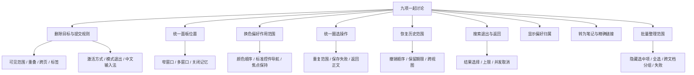

# 阅读与批注操作便利性决策

日期：2026-10-10。状态：Q1–Q24 已确认并实施；构建和自动化验收完成，环境限制与手动验收项见末尾。

## 已确认范围

用户选择一起梳理全部八项优化，并补充电子书键盘删除，共九项：

1. 统一电子书内外批注面板。
2. 想法输入框中 Tab 直接切换颜色，输入光标保持不变。
3. 统一鼠标与键盘圈选的颜色、重复范围和编辑返回行为。
4. 完善书内搜索退出及返回阅读位置。
5. 记忆字号与阅读布局。
6. 单条批注转为笔记时保留精确回原文链接。
7. 批注中心批量整理当前筛选结果。
8. 扩展删除、改色等操作的恢复入口。
9. 电子书支持键盘删除；当前可见页有多个批注时，用 A/S/D 等标签选定并删除目标。

已确认的交互要求：Tab 换色时不移动想法输入光标。用户分别以“全部按建议”“全部按建议”“同意 全部按建议”确认三轮 Q1–Q24；本文件完整方案据此整理。

## 实施前代码事实

- `src/main.ts:229` 的删除命令采用 Markdown 编辑器回调，电子书没有相同命令入口。
- `runtime/ebook-keyboard.js:172` 的 Backspace 用于返回临时圈选步骤，不是删除已保存批注。
- `src/reader.ts:387` 收到正文高亮点击后只尝试滚动外部批注侧栏。
- `src/reader.ts:95` 的电子书撤销历史只记录新建批注。
- `src/note-modal.ts:128` 的方向键换色会把焦点移到色板按钮。

## 决策树

## 第一轮：已确认

用户于 2026-10-10 回复“全部按建议”。以下为已确认并实施的产品决定。

| 编号 | 决策 | 建议 | 状态 |
| --- | --- | --- | --- |
| Q1 | 删除时“选中”的含义和目标来源 | 支持点击已有高亮、批注卡片及重新圈选原文；明确目标优先，否则列当前可见页候选 | 已确认 |
| Q2 | 目标确定后的删除确认 | 明确目标直接删除；多个候选先显示标签，按字母删除；配套删除后撤销 | 已确认 |
| Q3 | 唯一批注面板默认位置 | Obsidian 右侧栏；书内按钮控制同一面板，窄窗口采用抽屉 | 已确认 |
| Q4 | Tab 换色是否改变下一条的默认颜色 | 当前草稿生效，并记住当前原始文档最近用色；不改全局默认色 | 已确认 |
| Q5 | 鼠标与键盘圈选的统一程度 | 同色板、同重复范围规则、编辑结束返回正文；鼠标操作条靠近选区 | 已确认 |
| Q6 | 书内搜索结束后的阅读位置 | 关闭保留当前命中位置；提供单独“返回搜索前位置” | 已确认 |
| Q7 | 字号和阅读布局偏好归属 | 全局默认值，各原始文档可记住独立覆盖 | 已确认 |
| Q8 | 批量整理和单条转为笔记的范围 | 当前筛选结果可多选，批量颜色/标签/导出；单条转笔记附精确链接 | 已确认 |
| Q9 | 批注撤销的覆盖范围 | 新建、删除、想法、颜色、标签、分组；限本次插件运行，按原始文档隔离 | 已确认 |

## 第二轮：已确认

用户于 2026-10-10 再次回复“全部按建议”。以下规则已确认并实施。

| 编号 | 决策 | 建议 | 状态 |
| --- | --- | --- | --- |
| Q10 | 删除模式激活与退出 | 扩展现有删除命令，用户绑定键位；触发后处理目标，不复用长按空格或 Backspace；一次删除后退出 | 已确认 |
| Q11 | 当前可见页及候选数 | 包括双页和连续滚动视口中任何可见部分；跨页批注按一条计；无候选提示，一条直接删，多条用标签；重叠项分别列摘录与想法 | 已确认 |
| Q12 | 选择与标签有效期 | 正文目标离开可见区后失效；主动在侧栏选择卡片则以卡片为目标；正文明确新操作清除旧卡片选择；切书清除旧目标；翻页、重排及候选变化退出标签模式 | 已确认 |
| Q13 | 面板状态及多窗口 | 新文档沿用当前开关，各书记住覆盖；关闭后不因普通保存重开；明确查看批注时可打开；抽屉与侧栏共用内容，各窗口跟随各自活动文档 | 已确认 |
| Q14 | 色板顺序、偏好及控件导航 | 设置顺序固定，包含自定义色；保存成功才记最近色，取消不改变；已有批注先显示自身颜色；提供控件导航模式及关闭 Tab 换色设置 | 已确认 |
| Q15 | 编辑关闭与重复范围 | 精确相同范围编辑原记录，部分重叠可新建；保留点击外部保存变化、Esc 放弃；失败保留草稿与选区，焦点返回发起入口 | 已确认 |
| Q16 | 搜索结果与显示恢复 | 上下键选结果、Enter 跳转、Esc 关闭归还正文；查询变化取消过期搜索；显示结果上限；搜索前位置只在同文档本次搜索会话有效；字号和布局采用默认值加文档覆盖 | 已确认 |
| Q17 | 批量选择与操作失败 | 全选限当前筛选结果，改变筛选清空选择；加标签为集合合并；批量提交全部成功或整体恢复；跨文档不合并为同一分组 | 已确认 |
| Q18 | 撤销路由与恢复冲突 | 明确批注撤销命令，正文编辑器撤销保留原行为；批量操作一组撤销，多文档组整体恢复；来源改名跟随身份，旧分组不存在则恢复未分组并提示，冲突及失败保留历史 | 已确认 |

## 第三轮：已确认

用户于 2026-10-10 回复“同意 全部按建议”。以下规则已确认并实施。

| 编号 | 决策 | 建议 | 状态 |
| --- | --- | --- | --- |
| Q19 | 控件导航入口与编辑器键位 | 弹窗每次打开默认输入换色模式，F6 局部切换至标准 Tab/Shift+Tab 控件导航，另有可点击按钮；切回保留原输入选区；Esc 始终放弃，Ctrl/Cmd+Enter 保存；删除和撤销全局命令由用户绑定 | 已确认 |
| Q20 | 转笔记与导出保存位置和重名 | 单条沿用原文同目录、摘录命名、重名加序号；批量默认 Learning/Notes，可配置目录；文件名含来源或“批注导出”及日期时间；生成新快照，重名加序号；新标签打开 | 已确认 |
| Q21 | 导出内容与排序 | 按原始文档分组，组内按原文位置排序；包含摘录、想法、标签、颜色名、位置和精确链接；失联批注保留内容及状态 | 已确认 |
| Q22 | 默认显示与新文档面板 | 默认 100% 字号、分页阅读；新文档按 Q13 沿用当前面板开关，无任何已知偏好时默认关闭；原有开关记忆保留；提供当前书恢复全局默认；固定布局隐藏无效字号控制 | 已确认 |
| Q23 | 同范围重复记录与临时圈选冲突 | 已存重复范围不自动合并，列候选分别编辑删除；临时圈选时删除命令先用该范围匹配已有批注，不匹配则提示并保留圈选；禁止退回当前页自动删除其他目标 | 已确认 |
| Q24 | 删除适用范围、标签稳定、失败和撤销冲突 | A/S/D 删除标签首期用于电子书，不依赖圈选功能开关；Markdown 沿用光标入口，PDF 支持卡片删除和恢复；标签按可见阅读顺序稳定分配，容量不足用等长双字母；输入法及长按不误删；保存失败保留目标供重试；另一视图已删除不改删其他项；恢复冲突保留历史并提示 | 已确认 |

## 完整验收范围

覆盖 Markdown、PDF、电子书可用入口；正文与卡片入口；中文输入法；双页、连续滚动、跨页及重叠批注；多窗口和同书多视图；开关、字号及位置重开恢复；单条和批量持久化失败；删除与跨文档批量撤销；导出重名与精确回原文。使用真实宿主验证焦点与命令路由，不以合成事件代替真实输入法验收。

## 最终方案与实现清单

以下行为共同构成本轮实现范围，不再新增产品选项。Q1–Q24 是选择依据，本节是实现与验收清单。

| 项目 | 最终行为 | 验收重点 |
| --- | --- | --- |
| 唯一批注面板 | 电子书不再并列内外两份批注列表；书内按钮控制所属窗口同一批注面板，窄窗口以抽屉呈现；点击高亮联动对应卡片 | 内外能力一致；普通保存不重开已关闭面板；多窗口不串书；双标签同时开书各自正确 |
| 输入中换色 | 想法输入框 Tab 正向、Shift+Tab 反向循环固定色板，保留焦点、输入选区与滚动位置；包含自定义色；只有成功保存才更新当前书最近用色 | 光标在句中、文字被选中、中文组词、按键重复和保存中均不破坏输入；旧批注先显示自身颜色 |
| 控件导航 | 每次打开编辑器默认输入换色模式；F6 或可点击按钮切换标准 Tab 导航；切回恢复原光标；Esc 放弃，Ctrl/Cmd+Enter 保存 | 可纯键盘访问标签、色板与按钮；F6 在宿主弹窗内有效；关闭换色设置后恢复标准导航 |
| 统一圈选与编辑 | 鼠标与键盘共享颜色、重复范围与保存规则；鼠标操作条靠近选区；精确相同范围编辑原记录，部分重叠可新建，已有重复记录列候选分别处理 | 成功或取消返回发起入口；外部点击沿用保存变化，Esc 放弃；失败保留草稿与范围；不意外重复创建 |
| 电子书键盘删除 | 扩展现有删除命令，用户自行绑定键位；有明确批注选择优先处理；文字圈选只匹配对应已有记录，无匹配保留圈选并提示；无选择时取当前可见页，零条提示、一条直接删、多条按标签删除 | 双页、连续滚动、跨页部分可见与重叠候选正确；候选按阅读顺序；容量不足用等长双字母；一次删除后退出；Esc 取消；圈选开关关闭时仍可用 |
| 删除状态与失败 | 正文目标离开视口后失效，侧栏主动选卡片优先；切书清目标；翻页、重排或候选变动退出标签；删除中禁止重复提交，失败保留目标；另一视图已删除则提示 | 不使用过期标签；不因范围无匹配或目标消失改删别条；中文输入法与长按不误删 |
| 搜索闭环 | 上下键选结果，Enter 跳转，Esc 关闭并归还正文焦点；关闭清理结果与搜索标记，停在当前命中位置；另有返回本次搜索前位置的操作；新查询取消过期搜索，显示数量和上限 | 旧查询不覆盖新结果；搜索中可退出；跨书不复用返回位置；无结果与上限信息明确 |
| 显示偏好 | 全局默认 100% 字号、分页阅读；各书覆盖字号和布局；初次打开时同步恢复控件与正文；可恢复全局默认；面板开关按 Q13/Q22 继承与记忆；固定布局隐藏无效字号控制 | 重开与重启不丢偏好；不先闪默认字号再跳变；不破坏阅读位置或原有固定布局 |
| 单条转笔记与导出 | 转笔记保持原文同目录与摘录命名，并附精确链接；批量输出至可配置目录，默认 Learning/Notes；来源或“批注导出”加日期时间，重名加序号，生成新快照并在新标签打开 | 按原始文档分组、按原文位置排序；包含摘录、想法、标签、颜色名、位置、精确链接；失联记录保留内容和状态；精确链接改名后仍有效 |
| 批量整理 | 批注中心选择当前筛选结果，全选限该结果；改变筛选清空选择；改色覆盖、加标签合并；提交全部成功或整体恢复，失败保留选择；分组仍限同文档 | 没有隐藏选中项误操作；不使用逐条保存造成半成功；不跨书合并分组；导出选择集正确 |
| 批注撤销 | 新建、删除、想法、颜色、标签及分组均可撤销；只保留本次运行历史；文档隔离，跨文档批量操作关联为一个整体；明确批注撤销命令，输入框文字撤销保持原行为 | 删除恢复原 ID、位置和内容；一批操作一组撤销；改名跟随身份；旧分组缺失恢复未分组并提示；冲突或保存失败保留历史 |

### 实现顺序

1. 先完善共享批注修改、提交与撤销行为，承接电子书删除和批量整理的恢复要求。
2. 输入换色及控件导航、统一圈选编辑和单一批注面板。
3. 可见页候选、批注选择和标签删除，完成宿主键位与焦点验证。
4. 搜索闭环、显示偏好恢复、批量整理及输出快照。
5. 构建、规范检查、行为测试及浏览器/宿主验收，修复发现的问题后交付全部范围。

### 执行状态

- 三轮全部决定：已确认。
- 决策文档、术语和旧撤销范围说明：已更新。
- 运行代码：Q1–Q24 已实施。
- 构建产物：已更新 `main.js` 和 `styles.css`。
- 自动化与宿主验收：见下表。
- 用户已授权实施，不再等待方案确认。

## 既有约束

- 沿用 ADR-0001：原始文档保存在知识库，不新增独立书架身份。
- 沿用 ADR-0002：转为笔记和 Markdown 导出是用户主动生成的快照，不引入双向同步。
- 第一轮已确认扩展撤销范围，覆盖旧设计“只撤销电子书新建”的产品范围；现由共享批注操作历史实现。
- “批注选择”“当前可见页”已写入 CONTEXT.md。

## 完成条件

每个分支的操作、取消、失败、焦点、多文档行为及必要边缘场景均有明确决定；已据确认方案实现，并记录实际验证结果及未覆盖项。

## 实现与验收记录

### 主要实现

- `src/annotation-operations.ts` 负责串行提交、批量原子操作和按文档隔离的会话撤销。失败恢复内存、保留历史；并发删除同一目标不会转删其他记录。
- `src/sidebar.ts` 的 `AnnotationPanel` 同时用于宿主侧栏和阅读器抽屉。宽窗口显示外侧面板，窄窗口和独立窗口显示抽屉，各窗口跟随各自文档。
- `src/note-modal.ts` 实现 Tab/Shift+Tab 固定色板换色、F6 控件导航、光标与滚动恢复；设置关闭换色后保留标准 Tab 导航。
- `runtime/ebook-delete.js` 处理已保存批注的可见范围和标签删除。正文圈选无精确匹配时不会退回删除其他目标；双页、连续滚动及跨页部分可见都按完整记录处理。
- `src/annotation-export.ts` 生成排序快照和精确回原文链接；批注中心支持当前筛选集的批量改色、标签合并、导出。
- 删除入口名称为“删除批注（光标 / 选择 / 可见页）”，统一撤销入口为“撤销上次批注操作”；沿用原命令 ID，已有键位继续有效，适用 Markdown、PDF 和电子书。
- 书内搜索支持键盘选结果、取消过期查询、退出清理标记及返回搜索前位置；字号、布局、面板开关按书恢复。
- 独立窗口消息用宿主预置会话标识校验：插件代码从主窗口发消息时，其消息源不等于独立窗口内 iframe 的父窗口，旧的父窗口校验会拒绝合法初始化。真实宿主回归覆盖该故障，并保留其他会话消息拒绝检查。

### 自动化验证

| 命令 | 实际结果与覆盖 |
| --- | --- |
| `npm test` | 31 项通过；包括保存失败、草稿与范围、Tab/输入法事件保护、跨文档批量撤销、改名和冲突、并发删除、旧分组缺失恢复、导出及存储迁移 |
| `npm run build` | TypeScript 检查及生产构建通过 |
| `npm run lint` | 通过，无错误或警告 |
| `npm run test:keyboard` | 34 项浏览器检查通过；包括单句段落一次选中、稳定标签、单条直接删除、范围无匹配不误删、重复记录、失败重试、双字母、重排失效、连续滚动部分可见、跨页范围、固定双页、搜索清理与会话校验 |
| `npm run test:host` | 21 项真实 Obsidian 检查通过；包含实际 Tab/F6、快捷键路由、共享面板、批量回滚、输出快照、不同书多窗口及进程重启恢复 |
| `npm run test:popout` | 真实独立窗口初始化回归通过；完整宿主测试还覆盖抽屉、卡片选择、想法编辑、换色、焦点返回及搜索 |
| `npm run test:ebooks` | 环境准备失败：本机缺少 Calibre 的 `ebook-convert`，未执行 EPUB/MOBI/AZW3/FB2 的完整转换格式套件。EPUB 的分页、滚动和固定布局已由上述浏览器及宿主测试验证 |

宿主验收使用新建临时知识库和独立配置目录，不读取或修改用户实际知识库。后台自动化模拟独立窗口的激活事件，再由浏览器发送实际卡片点击和编辑键位；独立窗口保存后返回卡片焦点也已验证。删除、撤销不新增默认全局快捷键，由用户在 Obsidian 快捷键设置中绑定。

### 尚需手动验收的边界

- 中文系统输入法：已验证合成 `compositionstart`、`isComposing`、`Process` 和旧事件编号保护，但没有把合成事件视为真实系统输入法验收。
- 多格式转换套件：在有 Calibre 的环境设置 `SCHOLIAST_CALIBRE` 为 `ebook-convert` 路径后执行 `npm run test:ebooks`。
- 实际用户知识库中不同主题、移动设备和 PDF 正文入口未做现场测试；PDF 卡片使用共享编辑/删除和撤销入口，扫描页批注存储由单元测试覆盖。
